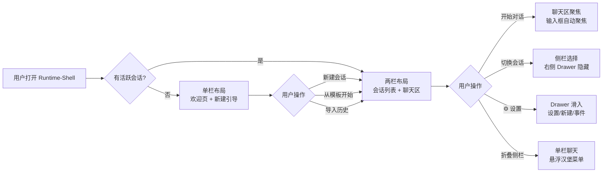
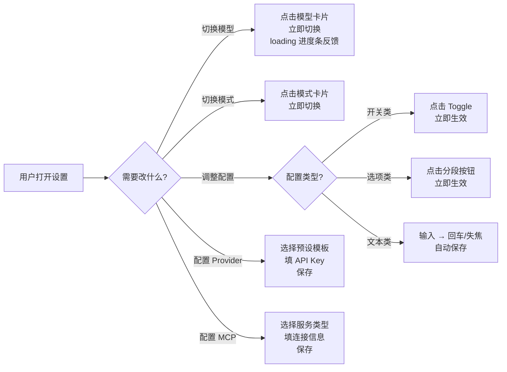
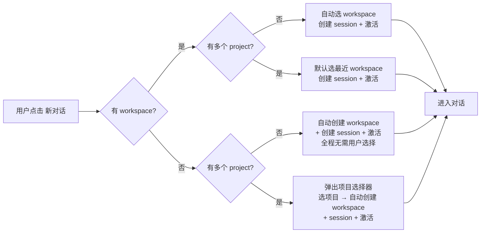

# Runtime-Shell 前端 UI/UX 诊断与重构建议

## 一、核心结论

当前 runtime-shell 前端界面**更像是一个面向开发者的功能验证平台，而非面向终端用户的产品界面**。主要问题集中在：**布局挤压、卡片交互不完整、消息展示层级不清、硬编码中文文案无法国际化**。

---

## 二、布局与信息架构（基于源码分析）

### 2.1 当前布局实现

`MainLayout.jsx` 使用 CSS Grid 三栏布局：

```jsx
// MainLayout.jsx — 当前 grid 定义
className="h-dvh min-h-0 grid p-3.5 gap-3.5 overflow-hidden items-stretch
  grid-cols-[260px_minmax(400px,1fr)_320px]
  xl:grid-cols-[280px_minmax(480px,1fr)_340px]
  max-[1100px]:h-auto max-[1100px]:overflow-y-auto max-[1100px]:grid-cols-[1fr]"
```

| 区域 | 默认宽度 | xl 宽度 | 组件 | 内容 |
|------|---------|---------|------|------|
| **左侧栏** | 260px | 280px | `LeftSidebar` | RS 品牌标识、账号信息、会话操作按钮、最近会话列表 |
| **聊天区** | min 400px, flex 1fr | min 480px, flex 1fr | `ChatView` | ConversationHeader → PhaseBanner → ConversationSection → ComposerSection |
| **右侧栏** | 320px | 340px | `RightSidebar` | 4 个 Tab：新建(workspace/session/fork/share) / 设置(worker/model/config/provider/mcp/skill/history) / 检查(metrics/permission/question/detail) / 事件(plan/stream) |
| **小屏** | `<1100px` 堆叠为单列 | 同左 | 全部 | order-1: 左侧栏 → order-3: 聊天区 → order-2: 右侧栏 |

### 2.2 六大核心问题

#### 问题 1：聊天区被两侧挤压，成为"夹心层"

用户的核心操作是**对话**，但对话框中区只占约 56% 的可用宽度（260 + 320 + gap ≈ 600px 被两侧占用，1440px 屏幕上聊天区约 804px）。右侧栏的 `settings`/`inspect`/`events` 面板在对话过程中几乎不需要，却始终占着 320px。

#### 问题 2：右侧栏功能与对话场景错位

```jsx
// RightSidebar.jsx — 当前 Tab 定义
export const TABS = [
  { id: 'create', label: '\u65b0\u5efa' },     // 新建
  { id: 'settings', label: '\u8bbe\u7f6e' },     // 设置
  { id: 'inspect', label: '\u68c0\u67e5' },     // 检查
  { id: 'events', label: '\u4e8b\u4ef6' },     // 事件
]
```

这四个 Tab 的使用场景分析：

| Tab | 何时使用 | 对话中需要吗？ |
|-----|---------|:---:|
| 新建 | 开始新会话/工作区前 | 否 |
| 设置 | 配置模型/MCP/Skill 时 | 偶尔 |
| 检查 | 排查问题或查看权限时 | 偶尔 |
| 事件 | 调试事件流时 | 否 |

**结论**：右侧栏 80% 的功能在 90% 的对话时间中不需要。这些面板应该移到**按需弹出的抽屉/弹窗**，而非始终占用屏幕空间。

#### 问题 3：左侧栏信息密度偏高但交互效率低

```jsx
// LeftSidebar.jsx — 从上到下的内容
// ① RS 品牌标识 + 描述 (占 ~80px)
// ② 账号信息 + 退出按钮 (占 ~90px)
// ③ 会话操作按钮 (打开/加载/恢复/关闭) + 共享提示 (占 ~160px)
// ④ 最近会话列表 (max-h-[300px] 滚动区)
```

- ①② 是低频信息（品牌和账号只在登录/登出时关注），但放在最顶部
- ③ 的 4 个按钮（打开当前会话/加载历史/恢复会话/关闭会话）语义接近但独立展示，对新用户不友好
- ④ 会话列表 `max-h-[300px]` 在大量会话时空间不足

#### 问题 4：输入区域（ComposerSection）冗长

```jsx
// ComposerSection.jsx — 从上到下
// ① 附件预览条
// ② textarea (3 行, min-h-[88px])
// ③ Prompt Mode 配置区 (当有 currentSessionId 时显示)
// ④ 底部工具栏 (调试事件 checkbox + 添加附件按钮 + 发送按钮)
```

③ 的 Prompt Mode 配置区（包含模式选择下拉 + "切换模式"按钮）在每个对话中都显示，占约 80px 高度。这个功能更适合收拢到底部工具条（与模型选择并列），§7.4.1 有详细方案。

#### 问题 5：色彩系统依赖 CSS 变量但未形成令牌体系

当前使用大量 CSS 变量（`--text-muted`、`--line`、`--surface`、`--brand` 等），但它们在 `index.css` 中分散定义，缺乏系统化的设计令牌（Design Tokens）层级。颜色值之间缺乏语义关系，修改主题色需要追踪多处。

#### 问题 6：小屏响应式策略简单粗暴

```css
/* max-[1100px] — 三项垂直堆叠 */
max-[1100px]:grid-cols-[1fr]
```

1100px 以下就全部堆叠，没有中间断点（如 768px iPad、480px 手机）。聊天体验在小屏上会将侧边栏和设置全部堆在对话上下，滚动距离极长。

### 2.3 目标布局架构

```
                           桌面端 (≥ 1024px)
┌──────────────────────────────────────────────────────────────────┐
│  [☰ 折叠]  Logo                     [⚙️ 设置]  [👤 {user}]     │  ← 顶部导航栏 (h-14)
├──────────┬───────────────────────────────────────────────────────┤
│          │                                                       │
│ 会话列表  │                  主聊天区域                           │
│ (可折叠)  │                                                       │
│ 280px    │   ┌──────────────────────────────────────────────┐    │
│          │   │ 🧠 推理过程 (3.2s)              [▲ 收起]     │    │
│          │   │   浅蓝背景 + 左侧色条折叠区                   │    │
│          │   └──────────────────────────────────────────────┘    │
│ ┌──────┐ │                                                       │
│ │ 今天  │ │   ┌──────────────────────────────────────────────┐    │
│ │ 会话1 │ │   │ 🤖 AI 回复 (Markdown 渲染)                   │    │
│ │ 会话2 │ │   │   带语言标签 + 复制的代码块                  │    │
│ └──────┘ │   │   工具调用预览条 (可展开)                     │    │
│          │   └──────────────────────────────────────────────┘    │
│ ┌──────┐ │                                                       │
│ │ 昨天  │ │   ┌──────────────────────────────────────────────┐    │
│ │ 会话3 │ │   │ 👤 你的消息 (金色气泡, 右对齐)               │    │
│ └──────┘ │   └──────────────────────────────────────────────┘    │
│          │                                                       │
│          │   ┌──────────────────────────────────────────────┐    │
│          │   │ 📝 输入消息...  ⚡Craft ▼ │ Kimi-K2.6 ▼ │ ⬆  │    │
│          │   └──────────────────────────────────────────────┘    │
│          │                                                       │
└──────────┴───────────────────────────────────────────────────────┘
│          │                                                       │
│          │   设置面板以 Drawer 从右侧滑入，而非始终可见           │
│          │   ┌─────────────────────┐                              │
│          │   │ ⚙️ 设置            │                              │
│          │   │ ├ 模型配置          │                              │
│          │   │ ├ Provider 配置     │                              │
│          │   │ ├ MCP 配置          │                              │
│          │   │ ├ Skill 管理        │                              │
│          │   │ └ Worker 概览       │                              │
│          │   └─────────────────────┘                              │
```

### 2.4 分阶段实施计划

**阶段一：右侧栏移除（1 周）**

```
MainLayout 改动：
  三栏 → 两栏
  grid-cols-[260px_minmax(400px,1fr)_320px]
  → grid-cols-[260px_1fr]

RightSidebar 改动：
  完全移除右侧栏
  原有功能迁移：
    - 新建 → LeftSidebar 顶部 "新对话" 按钮（一键创建，详见 §14）
    - 多项目/高级创建 → Drawer 中按需展开
    - 设置 → 顶部导航栏 ⚙️ 按钮 → Drawer 组件（380px，从右侧滑入）
    - 检查/事件 → 设置抽屉中的折叠区（开发者模式可见）
```

**阶段二：左侧栏重组（3 天）**

```
LeftSidebar 改动：
  ① 品牌 + 账号区精简为顶部一行 (avatar + username + logout)
  ② 会话操作折叠为 "..." 下拉菜单
  ③ 会话列表撑满剩余空间 (去掉 max-h-[300px]，改为 flex-1 overflow-y-auto)
  ④ 支持完全折叠 (只显示图标，hover 展开)
```

**阶段三：ComposerSection 精简（2 天）**

```
ComposerSection 改动：
  移除 ③ Prompt Mode 配置区 (移至底部工具条，与模型选择并列)
  输入框默认 2 行 (min-h-[60px])，聚焦后扩展到 max 6 行
  附件上传合并到输入框内部（仿 ChatGPT 的附件 chip）
  底部工具条：ModeSelector | ModelSelector | + 附件 | 发送按钮
```

**阶段四：响应式增强（2 天）**

```
新增断点：
  ≥ 1280px: 两栏展开（左侧栏 + 聊天区），Drawer 按需从右侧滑入
  1024-1279px: 左侧栏默认折叠，hover 展开
  768-1023px: 左侧栏隐藏，通过汉堡菜单唤出
  < 768px: 全屏聊天模式，导航在底部 tab bar
```

### 2.5 新布局架构流程图



### 2.6 色彩系统（Design Tokens）

建议在 `index.css` 或 `tailwind.config.js` 中建立三层语义令牌：

```css
/* 第一层：基础色板 */
--palette-brand: #d4a05a;         /* 品牌金色 */
--palette-brand-dark: #9c6e38;
--palette-bg-deep: #14100d;       /* 最深背景 */
--palette-bg-mid: #1c1814;        /* 卡片背景 */
--palette-bg-light: #231e19;      /* 消息气泡背景 */
--palette-success: #5a9e7c;
--palette-danger: #c44a3a;
--palette-warning: #d4a05a;

/* 第二层：语义令牌 */
--surface: var(--palette-bg-deep);
--surface-raised: var(--palette-bg-mid);
--surface-message: var(--palette-bg-light);
--text-primary: rgba(255,255,255,0.92);
--text-secondary: rgba(255,255,255,0.64);
--text-muted: rgba(255,255,255,0.42);
--border-subtle: rgba(181,148,116,0.09);
--border-normal: rgba(181,148,116,0.14);
--border-strong: rgba(181,148,116,0.22);

/* 第三层：组件令牌 */
--card-bg: var(--surface-raised);
--card-border: var(--border-normal);
--tool-success: var(--palette-success);
--tool-error: var(--palette-danger);
--tool-pending: var(--palette-warning);
```

**Light mode** 同理反转，用 `prefers-color-scheme` 或手动切换控制。

### 2.7 响应式断点策略

| 断点 | 宽度 | 布局策略 |
|------|------|----------|
| `2xl` | ≥ 1536px | 两栏展示（左 280px + 聊天 1fr），设置通过 Drawer 按需打开 |
| `xl` | ≥ 1280px | 两栏展示（左 260px + 聊天 1fr） |
| `lg` | ≥ 1024px | 两栏展示（左折叠 60px + 聊天 1fr） |
| `md` | ≥ 768px | 左栏隐藏（汉堡菜单唤出），聊天全宽 |
| `sm` | ≥ 640px | 聊天全宽，底部工具栏简化 |
| `default` | < 640px | 全屏聊天，所有面板以全屏 Sheet 形式呈现 |

---

## 三、卡片显示与交互分析（基于源码）

### 3.1 组件全景

runtime-shell 当前定义了 **10 种 block 类型**，路由在 `chat-blocks.jsx` 中：

```
ChatBlockItem (chat-blocks.jsx)
├── UserMessageBlock          — 用户消息（金色渐变气泡）
├── AssistantMessageBlock     — AI 消息（Markdown 渲染 + 流式打字）
├── ThinkingBlock             — 思考内容（默认折叠）
├── ToolBlock                 — 工具调用卡片
├── TodoBlock                 — 任务列表
├── PlanBlock                 — 执行计划
├── PermissionInlineBlock     — 权限确认
├── QuestionInlineBlock       — 交互提问（Schema 表单 / Legacy 多选）
├── StatusBlock               — 状态提示条
└── ErrorBlock                — 错误提示条
```

### 3.2 ToolBlock（工具调用卡片）

**文件**：`web/src/components/chat/blocks/ToolBlock.jsx`

**当前实现**：

- 单个卡片容器：深色背景 `rgba(20,16,13,0.35)`，失败时红色背景 `rgba(196,74,58,0.08)`
- 标题行：状态圆点（绿/红/黄）+ 状态文字（completed/failed/pending）+ tool kind + 展开/收起按钮
- 展开后：locations 标签 + input/output/content 三段式数据展示
- 宽度限制：`max-w-[640px]`，左对齐排列

**问题诊断**：

| 问题 | 具体表现 | 改进方向 |
|------|----------|----------|
| 位置标识来源单一 | 仅用圆点颜色区分状态，红绿色盲用户无法识别 | 增加图标（✔/✘/⏳）辅助区分 |
| 折叠态信息密度偏低 | 只显示 title，不知道工具做了什么 | 折叠态增加一行摘要（如 "读取 3 个文件，共 124 行"） |
| 展开后无高度限制 | 大段输出撑爆会话区 | 加 `max-h-[400px] overflow-y-auto` + 顶部渐变遮罩 |
| block.title 必填不可控 | title 由后端生成，可能有超长标题 | 加 `truncate` 或 `line-clamp-2` |
| 展开/收起按钮位置不一致 | 用 `ml-auto` 推到右侧，与其他卡片（PlanBlock）一致但视觉拥挤 | 可考虑用图标按钮替代文字 |

**改进示例**：

```jsx
// 当前：圆点颜色区分
<span className="inline-block w-2 h-2 rounded-full" style={{ background: statusColor }} />

// 建议：增加图标 + 保持圆点
{block.status === 'completed' && <CheckIcon size={12} />}
{block.status === 'failed' && <XIcon size={12} />}
{block.status === 'pending' && <SpinnerIcon size={12} />}
```

```jsx
// 当前：折叠态无摘要
<div className="min-w-0 text-xs font-semibold text-[var(--text-dim)] break-words">
  {block.title}
</div>

// 建议：折叠态增加一行摘要
<div className="min-w-0 text-xs font-semibold text-[var(--text-dim)] break-words">
  {block.title}
</div>
{!isOpen && block.summary && (
  <div className="text-[10px] text-[var(--text-muted)] truncate">{block.summary}</div>
)}
```

### 3.3 ThinkingBlock（思考内容）

**文件**：`web/src/components/chat/blocks/ThinkingBlock.jsx`

**当前实现**：

- 默认折叠，点击展开
- 折叠态：品牌色边框 + 标题 "Thinking" + 80 字符预览 + "展开" 文字
- 展开态：品牌色高亮边框 + 全文展示
- 右上角有 34×34 的头像区，显示"想"字

**问题诊断**：

| 问题 | 具体表现 | 改进方向 |
|------|----------|----------|
| 头像区显示"想"字 | 不够国际化 | 改用 🧠 或 💭 emoji，或用 CSS icon |
| 展开后面板与正文视觉分割弱 | 只有一个 `border-t` 分隔线 | 思考内容加浅蓝/浅灰背景色块包裹，左侧加色条 |
| 折叠态提示文案 "展开/收起" | 无意义，用户不知道里面是什么 | 改为 "显示推理过程 (3s)" / "隐藏推理过程" |
| 折叠态与展开态背景色切换突兀 | `bg-black/30` ↔ `bg-brand/10` 硬切换 | 加 transition，或用 CSS 变量统一管理 |

**改进示例**：

```jsx
// 当前头像
<div className="...">想</div>

// 建议：用 emoji/SVG（解耦文案）
<div className="..."><BrainIcon /></div>
```

```jsx
// 当前折叠态内容区
<div className="... border-[var(--line)] bg-black/30 ...">
  <span>Thinking</span>
  <span>{block.message.slice(0, 80)}</span>
  <span>{expanded ? '收起' : '展开'}</span>
</div>

// 建议：增加耗时、背景色差异
<div className="... bg-reasoning/8 border-reasoning/20 ...">
  <span>📋 推理过程</span>
  {block.duration && <span className="text-[10px] text-[var(--text-muted)]">({block.duration}s)</span>}
  <span className="ml-auto">{expanded ? '▲ 收起' : '▼ 展开详情'}</span>
</div>
```

### 3.4 AssistantMessageBlock（AI 消息正文）

**文件**：`web/src/components/chat/blocks/AssistantMessageBlock.jsx`

**当前实现**：

- 流式渲染期间用 `<pre>` 逐字符追加（避免 Markdown 闪烁）
- 流式结束后切换到 `<MarkdownContent>`（react-markdown + remark-gfm）
- AI 头像显示 "AI"，标签 "Assistant"，流式中有 "流式输出中..." 提示
- 消息气泡深色背景 `#231e19`，圆角 20px（左上 6px 尖角）

**问题诊断**：

| 问题 | 具体表现 | 改进方向 |
|------|----------|----------|
| 头像标签 "AI" 不够友好 | 缺乏个性 | 可用模型图标或首字母标识 |
| 流式标签 "流式输出中..." | 文案冗长，且硬编码 | 改为动画点 "..." 或省略 |
| Markdown 代码块无语言标签 | ReactMarkdown 的 code block 未渲染 language 标识 | 自定义 code 组件，始终展示 language badge |
| 消息气泡只有一个 | 多段内容在一个气泡中，视觉扁平 | 可考虑段落间加更多呼吸空间 |
| pre 标签切换 Markdown 有 1 帧空白 | 代码中已用 requestAnimationFrame 做了处理 | 用 CSS visibility 替代条件渲染 |

**改进示例**（代码块语言标签 + 复制按钮）：

```jsx
// MarkdownContent.jsx — code 组件改进
code: ({ inline, className, children, ...props }) => {
  if (inline) {
    return <code className="rounded bg-black/40 px-1 py-0.5 text-[0.9em] break-all">{children}</code>
  }
  const language = className?.replace('language-', '') || 'text'
  return (
    <div className="relative group my-3">
      <div className="flex items-center justify-between px-3 py-1.5 bg-black/60 rounded-t-[10px] border-b border-[var(--line)]">
        <span className="text-[10px] text-[var(--text-muted)] uppercase tracking-wider">{language}</span>
        <CopyButton text={String(children)} />
      </div>
      <pre className="max-w-full overflow-x-auto rounded-b-[12px] bg-black/45 p-3 m-0">
        <code className={className}>{children}</code>
      </pre>
    </div>
  )
}
```

### 3.5 UserMessageBlock（用户消息）

**文件**：`web/src/components/chat/blocks/UserMessageBlock.jsx`

**当前实现**：

- 右对齐，金色渐变背景 `linear-gradient(135deg, #d4a05a, #c1873e)`
- 标签 "You" + "刚刚"，头像显示 "U"
- 圆角 20px（右上 6px 尖角），浮层阴影

**问题诊断**：

| 问题 | 具体表现 | 改进方向 |
|------|----------|----------|
| 时间戳 "刚刚" 硬编码 | 静态文案，不反映实际发送时间 | 改为 block.timestamp 动态计算 |
| 标签 "You" | 英文硬编码 | i18n 化 |
| 头像 "U" | 无头像时可用首字母 fallback | 支持自定义头像或 emoji |

### 3.6 QuestionInlineBlock（交互提问卡片）

**文件**：`web/src/components/chat/question-form/index.jsx`

**当前实现**：

- 紫色边框 `border-brand/20` + `bg-brand/5` 背景
- 标题 "交互提问" + 消息文案 + 副标题提示
- 两套渲染路径：Legacy（多选 prompt）+ Schema（JSON Schema 表单）
- 回答状态：pending、submitting、resolved

**问题诊断**：

| 问题 | 具体表现 | 改进方向 |
|------|----------|----------|
| "交互提问" 文案不直观 | 用户不知道这是什么 | 改为 "需要你的选择" 或 "请选择" |
| 选项用原生按钮 `bg-success/10` | 所有选项颜色一样，未突出推荐选项 | 推荐选项用 `bg-brand`，其他用次要样式 |
| 多选无全选/取消全选 | Legacy 模式逐个点选效率低 | 增加全选/清空快捷操作 |
| 没有必填/选填标识 | 不知道哪些必答 | 必填项加红色星号 |
| 提交后无成功动画 | 按钮置灰无反馈 | 加 "✓ 已提交" 过渡动画 |

### 3.7 PermissionInlineBlock（权限确认卡片）

**文件**：`web/src/components/chat/blocks/PermissionInlineBlock.jsx`

**当前实现**：

- 紫色边框 + 标题 "权限请求"
- 工具名 + 数据预览
- 批准/拒绝按钮

**问题诊断**：

| 问题 | 具体表现 | 改进方向 |
|------|----------|----------|
| "批准/拒绝" 太生硬 | 缺少上下文说明批准意味着什么 | 按钮增加描述（如 "批准：允许读取文件"） |
| "提交中..." 文案 | 与发送按钮状态文字重复 | 统一按钮 loading 态 |
| 已处理后提示 "已处理，等待会话继续" | 位置不起眼 | 加绿色成功提示条 |

### 3.8 TodoBlock（任务列表）

**文件**：`web/src/components/chat/blocks/TodoBlock.jsx`

**当前实现**：

- 三态标记：`[ ]` pending / `[•]` in_progress / `[✓]` completed
- 空态显示 "Updating todos..."

**问题诊断**：

| 问题 | 具体表现 | 改进方向 |
|------|----------|----------|
| 标记符号为纯文本 | `[•]` 的圆点在不同字体下不一致 | 用 SVG icon 替代 |
| 空态文案 "Updating todos..." | 英文文案和整个界面不一致 | 改为中文占位或 loading spinner |

### 3.9 StatusBlock / ErrorBlock（状态/错误提示条）

**文件**：`web/src/components/chat/blocks/StatusBlock.jsx` / `ErrorBlock.jsx`

**当前实现**：

- 居中显示，半宽（max-w-[540px]）
- Status：灰色背景 + muted 文案
- Error：红色边框 + 红色文案

**问题诊断**：

| 问题 | 具体表现 | 改进方向 |
|------|----------|----------|
| Status/Error 无 icon | 纯文字难以一眼识别类型 | 加 ⚠️ / ℹ️ icon |
| 无关闭按钮 | 持久显示直到新 block 覆盖 | 可关闭的 toast 模式 |

---

## 四、消息展示与 Markdown 渲染

### 4.1 MarkdownContent 组件

**文件**：`web/src/components/chat/blocks/MarkdownContent.jsx`

- 使用 `react-markdown` + `remark-gfm`
- 自定义了 a、code、pre、table、th、td、ul、ol、p、blockquote 组件
- 表格包裹了 `overflow-x-auto` 横向滚动容器

**可改进项**：

1. **代码块无语言标签和复制按钮**（上文 3.4 已详述）
2. **图片无懒加载和放大预览** — 当前无 img 组件覆盖，默认 `` 无优化
3. **链接无安全标识** — `target="_blank"` 无 `rel="noopener noreferrer"`（已有 `noreferrer`，漏了 `noopener`）
4. **表格在小屏体验差** — 无最小宽度约束，极窄列难以阅读

### 4.2 流式渲染机制

`AssistantMessageBlock` 的流式路径：

1. `block.streaming=true` → 用 `createTextNode` + `nodeValue` 直接追加字符
2. 通过 `subscribeAssistantChunk` 监听实时 chunk 推送
3. `block.streaming=false` → `requestAnimationFrame` 后切换到 `<MarkdownContent>`
4. 有 `chunkVersion` 机制防止重复渲染

**潜在问题**：超长输出时，`nodeValue` 持续增长到一个巨大的字符串，可能造成 DOM 重排性能问题。可考虑 `contenteditable` false + `hidden` overflow 优化。

---

## 五、i18n 国际化方案

### 5.1 当前硬编码文案统计

runtime-shell 当前**零 i18n**。所有文案硬编码为中文（部分英文），分布如下：

| 组件 | 硬编码文案 | 数量 |
|------|-----------|------|
| ToolBlock | "收起"/"展开"、"输入"/"输出"/"内容"、status 字段 | 6+ |
| ThinkingBlock | "想"、"Thinking"、"收起"/"展开" | 4 |
| AssistantMessageBlock | "AI"、"Assistant"、"流式输出中..." | 3 |
| UserMessageBlock | "You"、"刚刚"、"U" | 3 |
| TodoBlock | "Todo"、"[✓]"/"[·]"/"[ ]"、"Updating todos..." | 4 |
| PlanBlock | "Plan"、"收起"/"展开" | 2 |
| PermissionInlineBlock | "权限请求"、"权限审批"、"批准"/"拒绝"、"提交中..."等 | 8+ |
| QuestionInlineBlock | "交互提问"、"需要你的确认"、"拒绝"/"提交"/"提交中..."等 | 8+ |
| StatusBlock / ErrorBlock | 动态文案（来自后端），无静态文案 | 0 |
| ComposerSection | "输入消息..."、"添加附件"、"发送"、"模式"、"切换模式"等 | 15+ |
| LeftSidebar | "会话导航"、"当前登录"、"会话操作"、"打开当前会话"、"加载历史"、"恢复会话"、"刷新"等 | 20+ |
| RightSidebar | "展开面板"、"新建"/"设置"/"检查"/"事件" Tab 标签 | 5 |
| 附件状态 | "待解析"/"解析中..."/"可发送"/"解析失败" | 4 |

**总计：约 65 个硬编码文案片段。**

### 5.2 技术方案

runtime-shell 技术栈：**React 18 + Vite + Tailwind CSS + Zustand**，无 SSR。推荐轻量 Context-based 方案。

**目录结构**：

```
web/src/
├── i18n/
│   ├── index.jsx              # I18nProvider + useT hook
│   ├── locales/
│   │   ├── zh-CN.json         # 简体中文
│   │   ├── en.json            # 英文
│   │   └── ja.json            # 日文（可选）
│   └── detect.js             # 浏览器语言检测
```

**核心实现**：

```jsx
// i18n/index.jsx
import { createContext, useContext, useState, useCallback, useEffect } from 'react'

const I18nContext = createContext(null)

export function I18nProvider({ children, defaultLocale = 'zh-CN' }) {
  const [locale, setLocale] = useState(() => {
    return localStorage.getItem('rs-locale') || defaultLocale
  })
  const [messages, setMessages] = useState({})

  const loadMessages = useCallback(async (loc) => {
    const mods = import.meta.glob('./locales/*.json')
    const mod = await mods[`./locales/${loc}.json`]()
    setMessages(mod.default || mod)
  }, [])

  useEffect(() => { loadMessages(locale) }, [locale])

  const changeLocale = useCallback((loc) => {
    localStorage.setItem('rs-locale', loc)
    setLocale(loc)
  }, [])

  return (
    <I18nContext.Provider value={{ locale, messages, changeLocale }}>
      {children}
    </I18nContext.Provider>
  )
}

export function useT() {
  const { messages } = useContext(I18nContext)
  return useMemo(() => {
    return (key, fallback = key) => {
      const keys = key.split('.')
      let value = messages
      for (const k of keys) {
        if (value == null) break
        value = value[k]
      }
      return value ?? fallback
    }
  }, [messages])
}
```

**字典结构**（`zh-CN.json`）：

```json
{
  "common": {
    "expand": "展开",
    "collapse": "收起",
    "submit": "提交",
    "cancel": "取消",
    "approve": "批准",
    "reject": "拒绝",
    "submitting": "提交中..."
  },
  "thinking": {
    "title": "推理过程",
    "expandHint": "展开详情",
    "collapseHint": "收起详情",
    "duration": "{{seconds}}s"
  },
  "tool": {
    "input": "输入",
    "output": "输出",
    "content": "内容",
    "status": {
      "completed": "已完成",
      "failed": "失败",
      "pending": "处理中"
    }
  },
  "assistant": {
    "label": "助手",
    "streaming": "输出中"
  },
  "user": {
    "label": "你",
    "justNow": "刚刚"
  },
  "todo": {
    "title": "任务列表",
    "updating": "更新中..."
  },
  "plan": {
    "title": "执行计划"
  },
  "permission": {
    "title": "权限请求",
    "subtitle": "权限审批",
    "waiting": "当前会话正在等待你处理这个权限请求",
    "approved": "已处理，等待会话继续",
    "approveOption": "批准：{{option}}"
  },
  "question": {
    "title": "需要你的选择",
    "subtitle": "需要你的确认",
    "waiting": "当前会话正在等待你回答这个问题",
    "submitted": "已提交，等待会话继续",
    "requiredMark": "*"
  },
  "sidebar": {
    "sessionNav": "会话导航",
    "sessionNavDesc": "选择会话、创建新会话，或继续历史上下文。",
    "currentLogin": "当前登录",
    "logout": "退出",
    "sessionActions": "会话操作",
    "openSession": "打开当前会话",
    "opening": "打开中...",
    "loadHistory": "加载历史",
    "loading": "加载中...",
    "resumeSession": "恢复会话",
    "resuming": "恢复中...",
    "closeSession": "关闭当前会话",
    "closing": "关闭中...",
    "refresh": "刷新",
    "recentActivity": "最近活动",
    "noSessions": "暂无会话，请先创建。",
    "selectHint": "请先从下方会话列表中选择一个会话，再执行打开、加载历史或恢复操作。",
    "sharedSession": "当前会话来自共享工作区协作{{ownerInfo}}。你可以继续对话和处理交互，但不能关闭该会话。",
    "sharedWorkspace": "共享工作区",
    "events": "事件",
    "settingsPanels": {
      "new": "新建",
      "settings": "设置",
      "inspect": "检查",
      "events": "事件"
    }
  },
  "composer": {
    "placeholder": "输入消息...",
    "noSession": "请先打开一个会话",
    "preparing": "会话正在打开或恢复，稍后即可发送",
    "send": "发送",
    "sending": "发送中...",
    "cancelling": "取消中...",
    "running": "模型生成中...",
    "waitingPermission": "等待审批中...",
    "waitingQuestion": "等待回答中...",
    "mode": "模式",
    "switchMode": "切换模式",
    "switchingMode": "切换中...",
    "promptMode": "Prompt Mode",
    "addAttachment": "添加附件",
    "debugEvents": "调试事件",
    "parsingAttachment": "解析附件中...",
    "attachmentNeedsFix": "附件需要处理",
    "attachmentUnsupported": "暂不支持这些附件格式：{{formats}}。当前仅支持 PDF、Markdown、XLSX、CSV 和图片。"
  },
  "attachment": {
    "pending": "待解析",
    "parsing": "解析中...",
    "ready": "可发送",
    "failed": "解析失败",
    "cancel": "取消",
    "removeAria": "移除附件 {{name}}"
  }
}
```

**字典结构**（`en.json`）：

```json
{
  "common": {
    "expand": "Expand",
    "collapse": "Collapse",
    "submit": "Submit",
    "cancel": "Cancel",
    "approve": "Approve",
    "reject": "Reject",
    "submitting": "Submitting..."
  },
  "thinking": {
    "title": "Reasoning",
    "expandHint": "Show details",
    "collapseHint": "Hide details",
    "duration": "{{seconds}}s"
  },
  "tool": {
    "input": "Input",
    "output": "Output",
    "content": "Content",
    "status": {
      "completed": "Completed",
      "failed": "Failed",
      "pending": "Pending"
    }
  },
  "assistant": {
    "label": "Assistant",
    "streaming": "Streaming"
  },
  "user": {
    "label": "You",
    "justNow": "Just now"
  },
  "todo": {
    "title": "Todo",
    "updating": "Updating..."
  },
  "plan": {
    "title": "Plan"
  },
  "permission": {
    "title": "Permission Required",
    "subtitle": "Permission Request",
    "waiting": "This session is waiting for you to handle this permission request",
    "approved": "Handled, waiting for session to continue",
    "approveOption": "Approve: {{option}}"
  },
  "question": {
    "title": "Your Input Needed",
    "subtitle": "Confirmation Required",
    "waiting": "This session is waiting for your answer",
    "submitted": "Submitted, waiting for session to continue",
    "requiredMark": "*"
  },
  "sidebar": {
    "sessionNav": "Session Navigator",
    "sessionNavDesc": "Select, create, or continue a session.",
    "currentLogin": "Logged In",
    "logout": "Log out",
    "logoutConfirm": "Are you sure you want to log out?",
    "sessionActions": "Session Actions",
    "openSession": "Open Session",
    "opening": "Opening...",
    "loadHistory": "Load History",
    "loading": "Loading...",
    "resumeSession": "Resume Session",
    "resuming": "Resuming...",
    "closeSession": "Close Session",
    "closing": "Closing...",
    "closeConfirm": "Close this session? This cannot be undone.",
    "refresh": "Refresh",
    "recentActivity": "Recent Activity",
    "noSessions": "No sessions yet. Create one to get started.",
    "selectHint": "Select a session from the list below before opening, loading history, or resuming.",
    "sharedSession": "Shared workspace session{{ownerInfo}}. You can chat and interact, but cannot close it.",
    "sharedWorkspace": "Shared Workspace",
    "events": "events",
    "settingsPanels": {
      "new": "Create",
      "settings": "Settings",
      "inspect": "Inspect",
      "events": "Events"
    }
  },
  "composer": {
    "placeholder": "Type a message...",
    "noSession": "Open a session to start",
    "preparing": "Session is opening, please wait",
    "send": "Send",
    "sending": "Sending...",
    "cancelling": "Cancelling...",
    "running": "Generating...",
    "waitingPermission": "Waiting for approval...",
    "waitingQuestion": "Waiting for answer...",
    "mode": "Mode",
    "switchMode": "Switch Mode",
    "switchingMode": "Switching...",
    "promptMode": "Prompt Mode",
    "addAttachment": "Add files",
    "debugEvents": "Debug Events",
    "parsingAttachment": "Parsing attachments...",
    "attachmentNeedsFix": "Attachment needs attention",
    "attachmentUnsupported": "Unsupported formats: {{formats}}. Only PDF, Markdown, XLSX, CSV and images are supported."
  },
  "attachment": {
    "pending": "Pending",
    "parsing": "Parsing...",
    "ready": "Ready",
    "failed": "Failed",
    "cancel": "Cancel",
    "removeAria": "Remove attachment {{name}}"
  }
}
```

### 5.3 组件接入示例

**改造前**（ToolBlock）：

```jsx
<button aria-label={isOpen ? '收起工具结果' : '展开工具结果'}>
  {isOpen ? '收起' : '展开'}
</button>
```

**改造后**：

```jsx
const t = useT()

<button aria-label={t(isOpen ? 'common.collapse' : 'common.expand')}>
  {t(isOpen ? 'common.collapse' : 'common.expand')}
</button>
```

**带参数的文案**：

```jsx
// ComposerSection 发送按钮
const t = useT()

<button>
  {sessionPreparing ? t('composer.preparing')
    : phase.id === 'submitting' ? t('composer.sending')
    : phase.id === 'cancelling' ? t('composer.cancelling')
    : phase.id === 'running' ? t('composer.running')
    : phase.id === 'waiting_permission' ? t('composer.waitingPermission')
    : phase.id === 'waiting_question' ? t('composer.waitingQuestion')
    : t('composer.send')}
</button>
```

### 5.4 语言切换与检测

在 MainLayout 右上角添加语言切换下拉：

```jsx
const { locale, changeLocale } = useI18n()

<select value={locale} onChange={(e) => changeLocale(e.target.value)}
  className="text-xs rounded-lg border border-[var(--line)] bg-black/30 px-2 py-1">
  <option value="zh-CN">中文</option>
  <option value="en">English</option>
  <option value="ja">日本語</option>
</select>
```

首次加载自动检测：

```jsx
// detect.js
export function detectLocale() {
  const stored = localStorage.getItem('rs-locale')
  if (stored) return stored
  const nav = navigator.language || 'zh-CN'
  if (nav.startsWith('zh')) return 'zh-CN'
  if (nav.startsWith('ja')) return 'ja'
  return 'en'
}
```

### 5.5 注意事项

1. **后端动态内容不做翻译** — block.title / block.message 是 AI 生成的，翻译引擎无法处理
2. **状态枚举值不做翻译** — block.status（如 `completed`/`failed`）是协议字段，译文通过 lookup 映射
3. **日期时间用 `Intl.DateTimeFormat`** — 比字典翻译更准确
4. **CSS 数值不变** — i18n 仅处理面向用户的文案
5. **字典 Key 用点号分隔** — 支持嵌套读取，保持 flat 也可读

---

## 六、设置项交互优化（基于源码分析）

### 6.1 当前设置面板全景

runtime-shell 的设置分布在 `RightSidebar` 的 settings tab 下，包含 7 个面板，垂直堆叠：

```
RightSidebar → Settings Tab
├── WorkerOverviewPanel     — Worker 状态概览
├── ModelSettingPanel       — 模型选择（下拉 + 按钮）
├── ConfigSettingPanel      — 运行时配置（两步操作）
├── ProviderConfigPanel     — Provider 配置（10+ 字段表单）
├── McpConfigPanel          — MCP 服务配置（服务器列表表单）
├── SkillConfigPanel        — Skill 管理
└── ConfigHistoryPanel      — 配置历史
```

### 6.2 核心问题诊断

#### 问题 1：所有设置同等对待，无优先级分层

| 设置项 | 使用频率 | 操作复杂度 | 当前位置 |
|--------|:--------:|:----------:|----------|
| 模型选择 | 每次对话 | 极低（选一下） | 埋在 settings tab |
| 运行时配置 | 偶尔 | 低（两选 + 按钮） | 埋在 settings tab |
| Prompt Mode | 偶尔 | 低 | 在 ComposerSection 中 |
| Provider 配置 | 初次设置后几乎不改 | 极高（10+ 字段） | 与上述同级 |
| MCP 配置 | 初次设置后极少改 | 极高（服务器列表） | 与上述同级 |
| Skill 管理 | 偶尔 | 中 | 与上述同级 |

**高频操作用了低频入口**，而低频操作占了和高频操作一样的视觉权重。

#### 问题 2：格式不统一，增加认知成本

```jsx
// ModelSettingPanel — 下拉 + 按钮
<Select options={capabilities.models} />
<button>切换模型</button>

// ConfigSettingPanel — 下拉 + 动态输入 + 按钮
<Select options={userConfigOptions} />  // 先选配置项
<select> / <input>                        // 再填配置值（类型随配置变化）
<button>更新配置</button>

// ProviderConfigPanel — 纯表单
<input placeholder="例如 deepseek" />     // 7+ 个 input
<input placeholder="模型 ID" />           // 动态行
<button>保存 Provider 配置</button>
```

三种面板用了三种不同的交互模式：下拉+按钮 / 两步向导 / 长表单。用户每打开一个面板都要重新理解它怎么用。

#### 问题 3：更改后必须点"保存/更新"按钮

所有设置都需要先选值，再点按钮。这是**传统表单思维**：
- 用户选择模型 → 还要记得点"切换模型"
- 用户改配置值 → 还要记得点"更新配置"

如果没有点保存就切换到别的 tab，更改就丢了。而且没有任何视觉反馈告诉用户"你还没保存"。

#### 问题 4：Provider/MCP 配置暴露过多技术细节

```jsx
// ProviderConfigPanel — 当前暴露的字段
providerId        // "deepseek" — 用户不需要知道这个
providerApi       // "@ai-sdk/openai-compatible" — 纯技术概念
providerNpm       // NPM 包名 — 纯技术概念
baseURL           // 技术概念但不是最难的
apiKey            // 用户能理解
defaultModel      // 用户能理解
models[]          // 模型 ID / 显示名 / API 名 — 三者让用户困惑
```

这些字段中只有 apiKey 和 defaultModel 对普通用户有意义。providerId、api、npm 是给开发者看的，应该放在"高级"层中默认折叠。

#### 问题 5：配置项（ConfigSettingPanel）的枚举值展示不直观

```jsx
// 当前：配置值是布尔值
<select>
  <option value="true">true</option>    // 用户看到的是 true/false
  <option value="false">false</option>  // 而不是"开启/关闭"
</select>
```

用 `true`/`false` 而非 `开启`/`关闭`，对非技术用户不够友好。

### 6.3 目标交互设计

#### 核心原则：简单易选，零学习成本

1. **即改即生效** — 选择即保存，不再需要单独点"保存"按钮
2. **高频优先** — 常用设置直接可见，低频设置按需展开
3. **统一交互** — 所有设置用同一种选择模式
4. **分层展示** — 普通用户看到 3 个设置，高级用户点"更多"看到全部
5. **有意义的选项** — 用人类语言而非技术术语

#### 分层设置架构

```
┌─────────────────────────────────────────────────────┐
│                    设置面板                           │
│                                                     │
│  ┌────────────────── 快捷设置 ────────────────────┐  │
│  │                                                │  │
│  │  模型                                                 │  │
│  │  ┌──────────┐ ┌──────────┐ ┌──────────┐       │  │
│  │  │ ● Kimi   │ │ ○ GPT   │ │ ○ Deep-  │       │  │
│  │  │   K2.5   │ │   4o     │ │   Seek   │       │  │
│  │  └──────────┘ └──────────┘ └──────────┘       │  │
│  │                                                │  │
│  │  Prompt Mode                                        │  │
│  │  ┌──────────┐ ┌──────────┐                    │  │
│  │  │ ● Craft  │ │ ○ Plan   │                    │  │
│  │  └──────────┘ └──────────┘                    │  │
│  │                                                │  │
│  └────────────────────────────────────────────────┘  │
│                                                     │
│  ┌──────────────── 更多设置 ──────────────────────┐  │
│  │  Provider 配置              [展开 ▼]         │  │
│  │  MCP 服务配置               [展开 ▼]         │  │
│  │  Skill 管理                  [展开 ▼]         │  │
│  │  Worker 概览                 [展开 ▼]         │  │
│  │  配置历史                    [展开 ▼]         │  │
│  └────────────────────────────────────────────────┘  │
│                                                     │
└─────────────────────────────────────────────────────┘
```

### 6.4 各设置项改造方案

#### 6.4.1 模型选择：设置面板用卡片选择器，底部工具条用 compact 下拉

> 与 Prompt Mode 类似，模型选择有两个场景。**设置面板**用卡片选择器（直观、空间充裕），**底部工具条**用 compact 下拉（§7.4.2）。两处联动，即改即生效。

**设置面板中的卡片选择器**（替换当前的下拉+按钮）：
```jsx
// ① 下拉选模型 → ② 点"切换模型"按钮 → ③ 等待
<Select value={selected} onChange={setSelected} options={capabilities.models} />
<button onClick={updateModel}>切换模型</button>
```

**改造后**：
```jsx
// 卡片单选，点击即切换，即时反馈
function ModelPicker({ models, currentModelId, onSelect }) {
  return (
    <div className="grid gap-2">
      <span className="text-xs font-medium text-[var(--text-dim)]">模型</span>
      <div className="grid gap-2">
        {models.map((model) => {
          const isActive = model.id === currentModelId
          return (
            <button
              key={model.id}
              onClick={() => onSelect(model.id)}
              disabled={isActive}
              className={`w-full text-left p-3 rounded-[12px] border transition-all ${
                isActive
                  ? 'border-brand bg-brand/10 shadow-glow'
                  : 'border-[var(--line)] bg-black/30 hover:border-[var(--line-strong)]'
              }`}
            >
              <div className="flex items-center gap-2">
                <span className={`w-2 h-2 rounded-full ${isActive ? 'bg-brand' : 'bg-[var(--text-muted)]'}`} />
                <span className="text-sm font-semibold">{model.name}</span>
                {isActive && <span className="ml-auto text-[10px] text-brand uppercase tracking-wider">当前</span>}
              </div>
              {model.description && (
                <div className="mt-1 text-[11px] text-[var(--text-muted)]">{model.description}</div>
              )}
            </button>
          )
        })}
      </div>
      {/* 切换中显示 loading 条 */}
      {pendingSettingsAction === 'model' && (
        <div className="h-0.5 bg-brand/30 rounded-full overflow-hidden">
          <div className="h-full bg-brand animate-pulse" style={{ width: '60%' }} />
        </div>
      )}
    </div>
  )
}
```

**关键改动**：
- 点击卡片 → 直接调用 `updateModel()`，不再需要"切换模型"按钮
- 当前模型用蓝色边框 + "当前"标签高亮
- 切换中展示 loading 进度条而非禁用整个面板
- 每个模型卡片可以展示简短描述（如 "长文本处理"、"代码能力强"）

#### 6.4.2 Prompt Mode：底部工具条用 compact 下拉，设置面板中保留卡片选择器

> Prompt Mode 有两个使用场景：**底部工具条**（对话中快速切换，compact 下拉）和**设置面板**（配置时使用，卡片单选）。两处选择联动，即改即生效。

**设置面板中的卡片选择器**（空间充裕，直观）：

```jsx
function ModePicker({ modes, currentModeId, onSelect }) {
  return (
    <div className="grid gap-2">
      <span className="text-xs font-medium text-[var(--text-dim)]">模式</span>
      <div className="grid grid-cols-2 gap-2">
        {modes.map((mode) => (
          <button
            key={mode.id}
            onClick={() => onSelect(mode.id)}
            className={`p-3 rounded-[12px] border text-center transition-all ${
              mode.id === currentModeId
                ? 'border-brand bg-brand/10 text-brand-text'
                : 'border-[var(--line)] bg-black/30 text-[var(--text-muted)] hover:border-[var(--line-strong)]'
            }`}
          >
            <div className="text-sm font-semibold">{mode.label}</div>
            {mode.description && (
              <div className="mt-0.5 text-[10px] opacity-70">{mode.description}</div>
            )}
          </button>
        ))}
      </div>
    </div>
  )
}
```

#### 6.4.3 运行时配置：布尔值用 Toggle，枚举值用 Segmented Control

**当前**（ConfigSettingPanel）：
```jsx
// 两步操作：先选配置项 → 再填值 → 点更新
<Select options={userConfigOptions} />
<select> / <input />     // 类型可变
<button>更新配置</button>
```

**改造后**：
```jsx
function QuickConfigPanel({ configOptions, onUpdate }) {
  const booleanConfigs = configOptions.filter(c => c.type === 'boolean')
  const enumConfigs = configOptions.filter(c => c.options?.length)
  const textConfigs = configOptions.filter(c => c.type !== 'boolean' && !c.options?.length)

  return (
    <div className="grid gap-3">
      <span className="text-xs font-medium text-[var(--text-dim)]">运行配置</span>

      {/* 布尔值 — Toggle Switch */}
      {booleanConfigs.map((config) => (
        <div key={config.id} className="flex items-center justify-between py-1">
          <div>
            <div className="text-sm">{config.label || config.id}</div>
            {config.description && (
              <div className="text-[11px] text-[var(--text-muted)]">{config.description}</div>
            )}
          </div>
          <button
            onClick={() => onUpdate(config.id, !config.currentValue)}
            className={`w-10 h-5 rounded-full transition-colors relative ${
              config.currentValue ? 'bg-brand' : 'bg-[var(--text-muted)]/30'
            }`}
          >
            <span
              className={`absolute top-0.5 w-4 h-4 rounded-full bg-white transition-transform ${
                config.currentValue ? 'translate-x-5' : 'translate-x-0.5'
              }`}
            />
          </button>
        </div>
      ))}

      {/* 枚举值 — Segmented Control */}
      {enumConfigs.map((config) => (
        <div key={config.id} className="grid gap-1.5">
          <div className="flex items-center justify-between">
            <span className="text-sm">{config.label || config.id}</span>
            {config.description && (
              <span className="text-[11px] text-[var(--text-muted)]">{config.description}</span>
            )}
          </div>
          <div className="flex rounded-[8px] border border-[var(--line)] overflow-hidden">
            {config.options.map((option, idx) => (
              <button
                key={option.value}
                onClick={() => onUpdate(config.id, option.value)}
                className={`flex-1 py-1.5 text-xs font-medium transition-colors ${
                  option.value === config.currentValue
                    ? 'bg-brand/15 text-brand-text'
                    : 'text-[var(--text-muted)] hover:bg-black/20'
                } ${idx < config.options.length - 1 ? 'border-r border-[var(--line)]' : ''}`}
              >
                {option.label}
              </button>
            ))}
          </div>
        </div>
      ))}

      {/* 文本值 — 保留 input，但改为失焦即保存 */}
      {textConfigs.map((config) => (
        <div key={config.id} className="grid gap-1.5">
          <span className="text-sm">{config.label || config.id}</span>
          <input
            defaultValue={config.currentValue}
            onBlur={(e) => {
              if (e.target.value !== config.currentValue) {
                onUpdate(config.id, e.target.value)
              }
            }}
            placeholder="输入值后按回车或失焦即保存"
            className={inputClassName}
            onKeyDown={(e) => {
              if (e.key === 'Enter') e.target.blur()
            }}
          />
        </div>
      ))}
    </div>
  )
}
```

**关键改动**：
- 布尔值用 iOS 风格的 Toggle Switch，点击即生效
- 枚举值用 Segmented Control（分段选择器），点击即选中
- 文本值用 input + onBlur（失焦）或 Enter 自动保存
- 完全消除"更新配置"按钮

#### 6.4.4 Provider 配置：折叠 + 预设模板 + 引导式填写

**当前**（ProviderConfigPanel）：7 个必填 input + 动态模型列表 + 保存按钮，展开即 200+ 行表单。

**改造后**：三层递进

```
第一层：快捷入口（始终可见）
┌─────────────────────────────────────────┐
│  Provider                    [DeepSeek] │
│  → AI 服务连接配置           [管理 ▼]  │
└─────────────────────────────────────────┘

第二层：预设模板（展开后第一屏）
┌─────────────────────────────────────────┐
│  选择预设 Provider                       │
│  ┌───────┐ ┌───────┐ ┌───────────┐     │
│  │ ●     │ │       │ │           │     │
│  │Deep-  │ │OpenAI │ │ 自定义... │     │
│  │Seek   │ │       │ │           │     │
│  └───────┘ └───────┘ └───────────┘     │
│                                         │
│  API Key           [●●●●●●●●] [显示]   │
│  默认模型          DeepSeek-V3           │
│                                         │
│  [▼ 高级配置]                            │
└─────────────────────────────────────────┘

第三层：高级配置（点了"高级"才展开）
┌─────────────────────────────────────────┐
│  Base URL    https://api.deepseek.com/v1│
│  Provider API  @ai-sdk/openai-compatible│
│  Model 列表    [展开编辑 ▼]              │
│                                         │
│  ⚠ 此配置将影响 3 个活跃会话             │
│  [保存]  [取消]                          │
└─────────────────────────────────────────┘
```

**关键改动**：
- 预设模板覆盖常见 Provider（DeepSeek/Kimi/OpenAI），自动填充 baseURL/api 等字段
- 第一屏只暴露 API Key + 默认模型两个核心字段
- 高级配置默认折叠，减少视觉噪音
- 自定义输入时提供 placeholder 示例和格式校验

#### 6.4.5 设置整体交互流程



### 6.5 设置面板的新版布局

将 RightSidebar 的 settings tab 重构为：

```
┌──────────────────────────────────────────────┐
│  ⚙️ 设置                                      │
│                                              │
│  ▸ 快捷设置                                   │
│  ┌──────────────────────────────────────────┐│
│  │  模型                                     ││
│  │  [Kimi K2.5 ●] [GPT-4o ○] [DeepSeek ○]  ││
│  │                                          ││
│  │  模式                                     ││
│  │  [Craft ●] [Plan ○]                     ││
│  │                                          ││
│  │  调试模式  [○────●]  关闭 / 开启         ││
│  └──────────────────────────────────────────┘│
│                                              │
│  ▸ 高级配置                                   │
│  ┌──────────────────────────────────────────┐│
│  │  Provider      [DeepSeek ▼]    [管理 →] ││
│  │  MCP 服务      已配置 2 个      [管理 →] ││
│  │  Skill         已安装 5 个      [管理 →] ││
│  │  Worker        3 个活跃        [查看 →] ││
│  │  配置历史                        [查看 →] ││
│  └──────────────────────────────────────────┘│
└──────────────────────────────────────────────┘
```

### 6.6 简化交互的核心理念对照

| 原则 | 当前做法 | 改进做法 |
|------|----------|----------|
| **即时生效** | 选值 → 点"保存"按钮 → 等待 | 选值 → 自动生效 → loading 微反馈 |
| **减少步骤** | 模型：3 步（下拉+按钮+等待） | 模型：1 步（点击卡片） |
| | 配置布尔：3 步（选配置+选值+按钮） | 配置布尔：1 步（点击开关） |
| **分层展示** | 7 个面板平铺，全部可见 | 快捷设置（3 项）+ 高级设置（折叠） |
| **人类语言** | `true`/`false`、`@ai-sdk/openai-compatible` | `开启`/`关闭`、预设模板名 |
| **反馈可见** | 保存按钮 loading 文案 | 进度条、选中态、成功微动画 |
| **容错** | 未保存离开 = 丢失 | 自动保存，无丢失风险 |

---

## 七、对话页面布局重构（参考 Agent 产品逻辑）

### 7.1 核心设计思想

图中 UI 展示的是标准 Agent 对话产品的交互范式，核心不是照搬每个元素，而是理解其**设计逻辑**：

1. **底部工具条一体化**：所有与"当前对话"相关的配置集中在输入区附近，不打断对话流
2. **即时生效**：选择即切换，不需要额外的"保存/确认"按钮
3. **视觉焦点**：发送按钮作为最突出的操作，使用强对比色和标志性形状
4. **信息分层**：高频配置一眼可见，低频配置收进二级入口

### 7.2 当前 ComposerSection 的问题

```jsx
// ComposerSection.jsx — 当前结构（垂直堆叠 4 层）
<section className="rounded-[20px] border... p-3">
  {/* ① 附件列表 */}
  {attachments.length > 0 && <div>...</div>}

  {/* ② textarea */}
  <textarea placeholder="输入消息..." />

  {/* ③ Prompt Mode 配置区 —— 占 80px+，表单级复杂度 */}
  {currentSessionId && (
    <div className="grid gap-2 rounded-[12px] border... px-3 py-2.5">
      <span className="uppercase text-brand">Prompt Mode</span>
      <div className="sm:grid-cols-[minmax(0,1fr)_auto]">
        <Field label="模式">
          <Select options={capabilities.modes} />
        </Field>
        <button onClick={() => updateMode(selectedMode)}>切换模式</button>
      </div>
    </div>
  )}

  {/* ④ 底部操作栏 */}
  <div className="flex justify-between">
    <label><input type="checkbox" /> 调试事件</label>
    <label>添加附件 <input type="file" /></label>
    <button type="submit">发送</button>
  </div>
</section>
```

**问题**：
1. **Prompt Mode 配置区占用 textarea 和按钮之间的大量空间**，让输入框视觉上被夹在中间
2. **模式切换需要 2 步**：下拉选择 → 点"切换模式"按钮，且按钮在右侧边缘
3. **调试复选框暴露给所有用户**，对普通用户是噪音
4. **发送按钮是普通的方形文字按钮**，在深色主题下不够突出
5. **模型选择完全在右侧面板**，用户发消息时想换模型需要离开输入上下文

### 7.3 目标布局：底部工具条一体化

基于 runtime-shell 实际有的功能（`capabilities.modes`、`capabilities.models`、附件、调试），重构为：

```
┌──────────────────────────────────────────────────────────────┐
│  消息列表（ConversationSection）                              │
│                                                              │
│                                                              │
│                                                              │
├──────────────────────────────────────────────────────────────┤
│  ┌────────────────────────────────────────────────────────┐  │
│  │  📄 report.pdf ✅  📊 data.xlsx ✅                    │  │  ← 附件预览条（条件渲染）
│  └────────────────────────────────────────────────────────┘  │
│  ┌────────────────────────────────────────────────────────┐  │
│  │                                                        │  │
│  │  输入消息...                                            │  │  ← textarea（无遮挡）
│  │                                                        │  │
│  │                                                        │  │
│  ├────────────────────────────────────────────────────────┤  │
│  │ ⚡ Craft ▼ │ K Kimi-K2.6 ▼ │ + │ ⬆  │                 │  │  ← 底部工具条（单行）
│  └────────────────────────────────────────────────────────┘  │
│                     ↑ 模式 │ 模型 │ 附件 │ 发送              │
└──────────────────────────────────────────────────────────────┘
```

**与图中 UI 的差异（贴合 runtime-shell 实际）**：

| 元素 | 图中 UI | runtime-shell 实际 | 改造策略 |
|------|---------|-------------------|----------|
| 模式选择 | Craft/Ask/Plan 下拉 | `capabilities.modes` | 同逻辑，用实际 modes 数据 |
| 模型选择 | Kimi-K2.6 下拉 | `capabilities.models` | 同逻辑，从右侧栏移至底部 |
| 技能 | 技能下拉 | **无此功能** | **不添加**，避免凭空造功能 |
| 权限 | 默认权限下拉 | 运行时 PermissionInlineBlock | **不添加预设**，保持现有内联卡片 |
| 附件 | + 图标 | 已有附件功能 | 文字按钮 → 图标按钮 |
| 语音 | 麦克风图标 | **无此功能** | **不添加** |
| 发送按钮 | 圆形黑色箭头 | 方形"发送"按钮 | 圆形图标化（通用改进） |

### 7.4 具体改造方案

#### 7.4.1 移除 Prompt Mode 配置区，改为底部工具条下拉

**当前**：textarea 上方有完整的 Prompt Mode 配置区（约 80px 高），含 label + select + button。

**改造**：将模式选择收拢为底部工具条左侧的 compact 下拉，选择即生效。

```jsx
// 改造前（ComposerSection.jsx L253-273）
{currentSessionId ? (
  <div className="grid gap-2 rounded-[12px] border... px-3 py-2.5">
    <span className="uppercase text-brand">Prompt Mode</span>
    <div className="grid gap-2 sm:grid-cols-[minmax(0,1fr)_auto]">
      <Field label="模式">
        <Select value={selectedMode} onChange={setSelectedMode}
          options={capabilities.modes} emptyLabel="当前会话没有可选模式" />
      </Field>
      <button onClick={() => updateMode(selectedMode)}>切换模式</button>
    </div>
  </div>
) : null}

// 改造后 —— 底部工具条中的 compact 下拉
function ModeSelector({ modes, currentModeId, onChange }) {
  const [open, setOpen] = useState(false)
  const current = modes.find((m) => m.id === currentModeId)

  return (
    <div className="relative">
      <button
        onClick={() => setOpen(!open)}
        className="flex items-center gap-1.5 px-2.5 py-1.5 rounded-lg text-xs
          text-[var(--text-dim)] hover:bg-black/20 transition-colors"
      >
        <span className="font-medium">{current?.label || current?.id || '模式'}</span>
        <svg className="w-3 h-3 opacity-60" viewBox="0 0 24 24" fill="none" stroke="currentColor">
          <path d="M6 9l6 6 6-6" />
        </svg>
      </button>

      {open && (
        <div className="absolute bottom-full left-0 mb-1 w-44 rounded-xl border
          border-[var(--line)] bg-[var(--surface)] shadow-xl overflow-hidden z-50">
          {modes.map((mode) => (
            <button
              key={mode.id}
              onClick={() => {
                onChange(mode.id)
                setOpen(false)
              }}
              className={`w-full px-3 py-2.5 text-left text-sm transition-colors
                hover:bg-black/20 ${mode.id === currentModeId ? 'bg-brand/10 text-brand-text' : ''}`}
            >
              {mode.label || mode.id}
            </button>
          ))}
        </div>
      )}
    </div>
  )
}
```

**关键改动**：
- 从 textarea 上方的"表单区"（80px+）降级为底部工具条的"按钮"（32px）
- 选择即调用 `updateMode(mode.id)`，**不再需要"切换模式"按钮**
- 下拉菜单从工具条向上展开（`bottom-full`），不遮挡输入区

#### 7.4.2 模型选择从右侧栏移至底部工具条

**当前路径**：右侧栏 → Settings Tab → ModelSettingPanel → 下拉 → "切换模型"按钮（4 步）。

**改造**：底部工具条直接展示当前模型，点击展开下拉切换，即时生效。

```jsx
function ModelSelector({ models, currentModelId, onChange }) {
  const [open, setOpen] = useState(false)
  const current = models.find((m) => m.id === currentModelId)

  return (
    <div className="relative">
      <button
        onClick={() => setOpen(!open)}
        className="flex items-center gap-1.5 px-2.5 py-1.5 rounded-lg text-xs
          text-[var(--text-dim)] hover:bg-black/20 transition-colors"
      >
        <span className="w-4 h-4 rounded-full bg-brand/20 flex items-center justify-center
          text-[10px] font-bold text-brand">
          {(current?.name || 'M')[0]}
        </span>
        <span>{current?.name || '模型'}</span>
        <svg className="w-3 h-3 opacity-60" viewBox="0 0 24 24" fill="none" stroke="currentColor">
          <path d="M6 9l6 6 6-6" />
        </svg>
      </button>

      {open && (
        <div className="absolute bottom-full left-0 mb-1 w-52 rounded-xl border
          border-[var(--line)] bg-[var(--surface)] shadow-xl overflow-hidden z-50">
          <div className="px-3 py-2 text-[10px] font-semibold uppercase tracking-wider
            text-[var(--text-muted)]">选择模型</div>
          {models.map((model) => (
            <button
              key={model.id}
              onClick={() => {
                onChange(model.id)
                setOpen(false)
              }}
              className={`w-full flex items-center gap-3 px-3 py-2.5 text-left
                transition-colors hover:bg-black/20 ${
                  model.id === currentModelId ? 'bg-brand/10' : ''
                }`}
            >
              <span className={`w-2 h-2 rounded-full ${
                model.id === currentModelId ? 'bg-brand' : 'bg-[var(--text-muted)]'
              }`} />
              <span className={`text-sm ${model.id === currentModelId ? 'text-brand-text font-medium' : ''}`}>
                {model.name}
              </span>
            </button>
          ))}
        </div>
      )}
    </div>
  )
}
```

**关键改动**：
- 从右侧栏"搬家"到底部工具条，切换路径从 4 步缩短为 2 步
- 当前模型用首字母 icon 标识，一目了然
- 选择即生效（直接调用 `updateModel`），无需额外按钮

#### 7.4.3 发送按钮改造：方形文字 → 圆形图标

**当前**（ComposerSection.jsx L299-321）：
```jsx
<button type="submit" disabled={sendDisabled}
  className="rounded-[10px] py-2 px-4 font-semibold text-sm bg-brand text-[#14100d] ...">
  {phase.id === 'submitting' ? '发送中...'
    : phase.id === 'running' ? '模型生成中...'
    : ...
    : '发送'}
</button>
```

**问题**：按钮文案随状态变化导致宽度跳动，且方形按钮在底部工具条中不够突出。

**改造**：
```jsx
function SendButton({ disabled, phase }) {
  const isLoading = phase.id === 'submitting' || phase.id === 'running'

  return (
    <button
      type="submit"
      disabled={disabled}
      className={`w-9 h-9 rounded-full flex items-center justify-center
        transition-all active:scale-90 ${
          disabled
            ? 'bg-[var(--text-muted)]/20 text-[var(--text-muted)]'
            : 'bg-[#14100d] text-white hover:brightness-110 shadow-lg'
        }`}
      title={isLoading ? '生成中...' : '发送'}
    >
      {isLoading ? (
        <svg className="w-4 h-4 animate-spin" viewBox="0 0 24 24" fill="none">
          <circle cx="12" cy="12" r="10" stroke="currentColor" strokeWidth="2" opacity="0.3" />
          <path d="M12 2a10 10 0 0 1 10 10" stroke="currentColor" strokeWidth="2" strokeLinecap="round" />
        </svg>
      ) : (
        <svg className="w-4 h-4" viewBox="0 0 24 24" fill="none" stroke="currentColor" strokeWidth="2.5" strokeLinecap="round">
          <line x1="22" y1="2" x2="11" y2="13" />
          <polygon points="22 2 15 22 11 13 2 9 22 2" />
        </svg>
      )}
    </button>
  )
}
```

**关键改动**：
- 方形文字按钮 → 圆形图标按钮（黑色背景 + 白色纸飞机 icon）
- 尺寸固定 36px，不再随文案长度跳动
- loading 状态用旋转 spinner 替代文字变化，视觉稳定
- 成为底部工具条最突出的元素

#### 7.4.4 调试模式隐藏

**当前**：底部操作栏有"调试事件"复选框（ComposerSection.jsx L277-285）。

**改造**：调试功能移至设置抽屉或默认隐藏，普通用户不暴露。

```jsx
// 从 ComposerSection 移除
// <label><input type="checkbox" checked={showDebug} ... /> 调试事件</label>

// 移至设置抽屉的高级选项中
// 或保留但默认折叠：在 textarea 输入特定命令（如 /debug）后显示
```

#### 7.4.5 附件按钮图标化

**当前**：文字按钮"添加附件"（ComposerSection.jsx L287-296）。

**改造**：+ 图标按钮，与图中 UI 一致。

```jsx
// 改造前
<label className="text-[11px] px-2.5 py-1.5 rounded-[8px] bg-brand/10 text-brand-text ...">
  {'添加附件'}
  <input type="file" ... className="absolute inset-0 opacity-0" />
</label>

// 改造后
<button className="w-8 h-8 rounded-lg flex items-center justify-center
  text-[var(--text-muted)] hover:bg-black/20 transition-colors relative">
  <input type="file" multiple accept=".pdf,.md,.markdown,.xlsx,.csv,image/*"
    onChange={handleFileChange} className="absolute inset-0 opacity-0 cursor-pointer" />
  <svg className="w-4 h-4" viewBox="0 0 24 24" fill="none" stroke="currentColor" strokeWidth="2">
    <line x1="12" y1="5" x2="12" y2="19" />
    <line x1="5" y1="12" x2="19" y2="12" />
  </svg>
</button>
```

#### 7.4.6 整体 ComposerSection 重构

```jsx
export const ComposerSection = memo(function ComposerSection({ currentSessionId }) {
  const sendPrompt = useStore((state) => state.sendPrompt)
  const updateMode = useStore((state) => state.updateMode)
  const phase = useConversationPhase()
  const capabilities = useSessionCapabilities()
  const [promptText, setPromptText] = useState('')
  const [attachments, setAttachments] = useState([])
  const [selectedMode, setSelectedMode] = useState(capabilities.modeId || '')

  // 模式切换即时生效
  const handleModeChange = useCallback((modeId) => {
    setSelectedMode(modeId)
    if (modeId && modeId !== capabilities.modeId) {
      void updateMode(modeId)
    }
  }, [capabilities.modeId, updateMode])

  const handleSend = useCallback(async (event) => {
    event.preventDefault()
    if (!promptText.trim()) return
    await sendPrompt(promptText, attachments.filter((a) => a.status === 'ready').map((a) => a.part))
    setPromptText('')
    setAttachments([])
  }, [promptText, attachments, sendPrompt])

  return (
    <section className="shrink-0 px-4 pb-4">
      {/* 附件预览 */}
      {attachments.length > 0 && (
        <div className="flex flex-wrap gap-2 mb-2 px-1">
          {attachments.map((att) => (
            <AttachmentBadge key={att.id} attachment={att} onRemove={() => cancelAttachment(att.id)} />
          ))}
        </div>
      )}

      {/* 主输入容器 */}
      <div className="rounded-2xl border border-[var(--line)] bg-[var(--surface)] shadow-lg backdrop-blur-xl">
        <textarea
          value={promptText}
          onChange={(e) => setPromptText(e.target.value)}
          rows={3}
          placeholder={!currentSessionId ? '请先打开一个会话' : '输入消息...'}
          className="w-full min-h-[80px] max-h-[200px] px-4 pt-3 pb-0 bg-transparent
            text-sm outline-none resize-y placeholder:text-[var(--text-muted)]"
          onKeyDown={(e) => {
            if (e.key === 'Enter' && !e.shiftKey) {
              e.preventDefault()
              if (promptText.trim()) void handleSend(e)
            }
          }}
        />

        {/* 底部工具条 —— 只放 runtime-shell 实际有的功能 */}
        <div className="flex items-center gap-1 px-3 py-2 border-t border-[var(--line)]">
          {/* 左侧：配置区 */}
          <div className="flex items-center gap-0.5 flex-1 min-w-0">
            {/* 模式选择 */}
            {capabilities.modes?.length > 0 && (
              <>
                <ModeSelector
                  modes={capabilities.modes}
                  currentModeId={selectedMode}
                  onChange={handleModeChange}
                />
                <div className="w-px h-4 bg-[var(--line)] mx-1" />
              </>
            )}

            {/* 模型选择 */}
            {capabilities.models?.length > 0 && (
              <ModelSelector
                models={capabilities.models}
                currentModelId={capabilities.modelId}
                onChange={(id) => void updateModel(id)}  // updateModel 来自 store
              />
            )}
          </div>

          {/* 右侧：操作区 */}
          <div className="flex items-center gap-1 shrink-0">
            {/* 附件按钮（+ 图标）*/}
            <button className="w-8 h-8 rounded-lg flex items-center justify-center
              text-[var(--text-muted)] hover:bg-black/20 transition-colors relative">
              <input type="file" multiple accept=".pdf,.md,.markdown,.xlsx,.csv,image/*"
                onChange={handleFileChange} className="absolute inset-0 opacity-0 cursor-pointer" />
              <svg className="w-4 h-4" viewBox="0 0 24 24" fill="none" stroke="currentColor" strokeWidth="2">
                <line x1="12" y1="5" x2="12" y2="19" />
                <line x1="5" y1="12" x2="19" y2="12" />
              </svg>
            </button>

            {/* 发送按钮 */}
            <SendButton disabled={!currentSessionId || !promptText.trim()} phase={phase} />
          </div>
        </div>
      </div>
    </section>
  )
})
```

### 7.5 布局联动：右侧栏瘦身与三栏改两栏

底部工具条接管了模型选择后，`RightSidebar` 的 Settings Tab 大幅瘦身：

| 原 Settings Tab 内容 | 新位置 | 说明 |
|---------------------|--------|------|
| ModelSettingPanel | 底部工具条 | 模型选择已迁移 |
| ConfigSettingPanel | 设置抽屉（折叠） | 运行时配置保留，默认折叠 |
| ProviderConfigPanel | 设置抽屉（折叠） | 仅初次设置时展开 |
| McpConfigPanel | 设置抽屉（折叠） | 同上 |
| WorkerOverviewPanel | 设置抽屉（折叠） | 开发者功能，默认隐藏 |
| ConfigHistoryPanel | 设置抽屉（折叠） | 历史查看功能 |

**布局从三栏变为两栏**：

```jsx
// MainLayout.jsx — 改造后（两栏）
className="h-dvh min-h-0 grid p-3.5 gap-3.5 overflow-hidden items-stretch
  grid-cols-[260px_1fr]
  xl:grid-cols-[280px_1fr]
  max-[900px]:grid-cols-[1fr]"
```

| 区域 | 宽度 | 内容 |
|------|------|------|
| **左侧栏** | 260px (xl: 280px) | 会话列表 |
| **聊天区** | flex 1fr | 消息 + 底部工具条 |
| **右侧栏** | 已移除 | 功能收拢至底部工具条/设置抽屉 |

### 7.6 与设置项优化的协同

底部工具条设计与第六节设置项优化形成闭环：

| 操作 | 新位置 | 交互方式 | 步骤 |
|------|--------|----------|------|
| 切换模型 | 底部工具条 | 点击下拉 → 选模型 | 2 步 |
| 切换模式 | 底部工具条 | 点击下拉 → 选模式 | 2 步 |
| 运行时配置 | 设置抽屉 | 点击设置 → Toggle/Segmented | 3 步 |
| Provider 配置 | 设置抽屉 | 点击设置 → 选预设 → 填 Key | 4 步 |

**高频操作（模型、模式）收拢到底部工具条，一步可达。**
**低频操作（Provider、运行时配置）收进设置抽屉，不影响主界面。**

---

## 八、总结与优先级

### 8.1 改进项总览

| 优先级 | 类别 | 改进项 | 影响范围 |
|--------|------|--------|----------|
| **P0** | 布局 | 三栏改两栏，移除右侧栏 | MainLayout |
| **P0** | 布局 | ComposerSection 底部工具条一体化 | ComposerSection |
| **P0** | 布局 | 模式/模型选择移至底部工具条，即时生效 | ComposerSection |
| **P0** | 布局 | 发送按钮改为圆形图标按钮 | ComposerSection |
| **P0** | 布局 | 调试模式从底部工具条移除 | ComposerSection |
| **P0** | 会话管理 | 点击会话即打开，移除"打开当前会话"按钮（§10.1） | LeftSidebar |
| **P0** | 会话管理 | 新建会话按钮移至 LeftSidebar 顶部（§10.2） | LeftSidebar |
| **P0** | 会话管理 | LeftSidebar 顶部 "新对话" 一键创建（§14.3） | LeftSidebar + Store |
| **P0** | 对话 UX | ConversationHeader 压缩为单行（§11.4） | ConversationHeader |
| **P0** | 对话 UX | 停止生成按钮移至 ComposerSection（§11.2） | ComposerSection |
| **P0** | 设置 | 模型选择改为卡片选择器，即改即生效 | ModelSettingPanel |
| **P0** | 设置 | 配置项改为 Toggle/Segmented Control，去"保存"按钮 | ConfigSettingPanel |
| **P0** | 消息展示 | 思考内容视觉升级（背景包装 + 左侧色条） | ThinkingBlock |
| **P0** | 卡片交互 | 工具卡片增加摘要 + 展开高度限制 | ToolBlock |
| **P0** | i18n | 建立 i18n 框架，字典覆盖全部静态文案 | 全局 |
| **P1** | 会话管理 | 会话列表信息展示改为用户视角（§10.3） | LeftSidebar |
| **P1** | 会话管理 | 会话列表按时间分组 + 搜索（§10.4） | LeftSidebar |
| **P1** | 会话管理 | 空状态欢迎界面（§10.5） | ChatView |
| **P1** | 会话管理 | 会话标题自动生成（由首条消息内容决定）（§14.3.3） | Store + API |
| **P1** | 对话 UX | 消息 hover 操作按钮（复制/重试）（§11.1） | MessageBlock |
| **P1** | 对话 UX | "回到底部"按钮精简为小圆形 icon（§11.3） | ConversationSection |
| **P1** | 冷启动 | 首次使用引导向导（§12.1） | App |
| **P1** | 冷启动 | Provider 未配置时的引导提示（§12.3） | ComposerSection |
| **P1** | 设置 | Provider 配置预设模板 + 分层展示 | ProviderConfigPanel |
| **P1** | 设置 | MCP/Skill/Worker 面板改为折叠卡片 | 多个面板 |
| **P1** | 设置 | 所有设置统一交互模式（即改即生效） | 全部设置面板 |
| **P1** | 卡片交互 | 代码块增加语言标签 + 复制按钮 | MarkdownContent |
| **P1** | 卡片交互 | Question/Permission 卡片视觉升级 | QuestionInlineBlock 等 |
| **P1** | 卡片交互 | 状态提示增加 icon + 可关闭 | StatusBlock / ErrorBlock |
| **P1** | 消息展示 | 用户消息时间戳动态计算 | UserMessageBlock |
| **P1** | 布局 | 左侧栏信息架构重组 | LeftSidebar |
| **P1** | 异常状态 | SSE 断连提示 + 自动重连 + 重连按钮产品化（§15） | SSE/EventSource 相关 |
| **P1** | 异常状态 | 模型错误可恢复提示 + 重试路径（§15） | ErrorBlock |
| **P2** | 对话 UX | 用户消息编辑重发 | UserMessageBlock |
| **P2** | 对话 UX | 键盘快捷键面板 | 全局 |
| **P2** | 布局 | 响应式断点精细化 | MainLayout |
| **P2** | 布局 | 设计令牌（Design Tokens）体系化 | index.css |
| **P2** | 设置 | 配置历史改为时间线视图 | ConfigHistoryPanel |
| **P2** | 消息展示 | 图片懒加载 + 放大预览 | MarkdownContent |
| **P2** | 卡片交互 | Todo/Plan 标记符号改为 SVG | TodoBlock / PlanBlock |

### 8.2 预期效果

- **布局**：从"三栏夹心"升级为"两栏聚焦"，聊天区从约 56% 扩展至约 80% 可用宽度，右侧栏完全移除
- **对话体验**：底部工具条一体化，模型/模式选择一步可达，发送按钮视觉焦点突出
- **设置体验**：从"选 → 点保存 → 等"升级为"点一下就好"，高频操作从 3 步减到 1 步
- **i18n 就绪**：支持中/英/日三语，全部静态文案通过字典管理
- **卡片专业化**：工具调用、提问、权限卡片从"功能可见"升级为"体验友好"
- **消息清晰度**：思考、正文、代码块各有独立视觉层级，一眼可辨
- **产品化感受**：从开发工具进化为专业 AI 协作平台

---

## 九、文档矛盾与错误修正（已修正）

### 9.1 内部矛盾

| # | 矛盾点 | 出处 A | 出处 B | 修正方案 |
|---|--------|--------|--------|----------|
| 1 | **模型选择位置冲突** | §2.3 目标布局图：顶部导航栏 "[模型: Kimi K2.5 ▼]" | §7.4.2：底部工具条模型下拉 | **统一为底部工具条**。顶部导航栏只放品牌 + 全局操作（设置/用户），与 ChatGPT/Claude 一致。删除 §2.3 中顶部导航的模型选择 |
| 2 | **模型选择 UI 形态冲突** | §6.4.1："卡片选择器"（ModelPicker，竖排卡片） | §7.4.2："底部工具条下拉"（ModelSelector，compact 下拉） | **底部工具条用 compact 下拉**（节省空间）；设置抽屉中保留卡片选择器（空间充裕时更直观）。两个场景用不同形态不矛盾，但文档应明确区分 |
| 3 | **Prompt Mode 位置冲突** | §2.4 阶段三："移至顶部 header 的模型选择器" | §6.4.2："移至快捷设置" | §7.4.1："底部工具条 compact 下拉" | **统一为底部工具条**，与模型选择并列。删除 §2.4 和 §6.4.2 中的旧位置描述 |
| 4 | **右侧栏命运冲突** | §2.4 阶段一："保留 collapsed 状态，默认 collapsed=true" | §7.5："布局从三栏变为两栏"，右侧栏完全移除 | §2.7："2xl ≥ 1536px 三栏展示" | **采用 §7.5 方案**：三栏改两栏，右侧栏移除。所有功能收至底部工具条或设置抽屉。删除 §2.4 中的"保留 collapsed"和 §2.7 中的三栏描述 |
| 5 | **技能选择矛盾** | §8.2："模型/模式/技能选择一步可达" | §7.3："无此功能，不添加" | **删除 §8.2 中的"技能"**，与 §7.3 保持一致 |
| 6 | **创造力/回复长度滑块** | §6.3 分层设置架构图："创造力 [保守○───●──灵活]"、"回复长度 [简洁○──●───详细]" | runtime-shell 实际无 temperature/max_tokens UI 暴露 | **删除滑块**。这两个配置项不在 `capabilities` 或 `userConfigOptions` 中。如未来后端支持，再添加 |

### 9.2 事实性错误

| # | 错误 | 位置 | 修正 |
|---|------|------|------|
| 1 | 目标布局图写 "👤 彦祖" | §2.3 | 用户名是动态的，改为 `👤 {user.displayName}` |
| 2 | 硬编码文案统计 "约 80+ 个" | §5.1 | 逐项相加实际约 65 个，改为 "约 65 个" |
| 3 | i18n `useT()` 返回 `useCallback` 依赖 `messages` | §5.2 | `messages` 每次语言加载都变化 → 返回新的 callback → 所有消费组件重渲染。改为 `useMemo` 缓存翻译函数 |
| 4 | i18n 动态 import 用模板字面量 | §5.2 | `import(\`./locales/${loc}.json\`)` 在 Vite 中需要显式 glob 声明才能 tree-shake。改为静态映射或 `import.meta.glob` |
| 5 | `shadow-glow` Tailwind 类名 | §6.4.1 等 | 非标准 Tailwind utility，需在 `tailwind.config.js` 中自定义或改为内联 style |
| 6 | "聊天区只占约 1/3 的可用宽度" | §2.2 问题 1 | 实际计算：1440px - 260 - 320 - 28(gap×2) - 28(padding×2) ≈ 804px，约 56%，不是 1/3。但仍然偏窄，结论正确数字有误 |

### 9.3 正文修正清单

| 章节 | 修正项 |
|------|--------|
| §2.3 | 删除顶部导航栏的模型选择，删除 "👤 彦祖" 改为动态用户名 |
| §2.4 阶段三 | "Prompt Mode 移至顶部 header" → 改为 "移至底部工具条" |
| §2.7 | "2xl ≥ 1536px 三栏展示" → 改为 "两栏，设置通过 Drawer 按需打开" |
| §5.1 | "约 80+" → "约 65" |
| §5.2 | `useT()` 改用 `useMemo`；动态 import 改为 `import.meta.glob` |
| §6.3 | 删除 "创造力" 和 "回复长度" 滑块（runtime-shell 无此配置项） |
| §6.4.1 | 明确区分：底部工具条用 compact 下拉，设置抽屉中用卡片选择器 |
| §6.4.2 | "移至快捷设置" → 改为 "移至底部工具条" |
| §8.2 | 删除 "技能选择"，改为 "模型/模式选择一步可达" |

---

## 十、会话管理 UX 专项改进（参考 ChatGPT/Claude/Kimi）

### 10.1 当前会话流程的致命问题

当前 runtime-shell 的会话操作链是：

```
① 在左侧栏会话列表中点击会话（选中高亮）
    → ② 点击"打开当前会话"按钮
    → ③ 等待会话打开
    → ④ 在聊天区输入消息
```

对比 ChatGPT / Claude / Kimi：

```
① 在左侧栏会话列表中点击会话
    → ② 直接进入对话，输入消息
```

**差异**：runtime-shell 多了"选中 → 点打开"两步分离操作。这是"验证平台思维"的典型体现——先选对象，再执行动作。但用户心理模型是"点击即进入"。

**改造方案**：

```jsx
// 改造前（LeftSidebar.jsx L148-150）
<button onClick={() => setCurrentSession(session.id)}>
  {session.title}
</button>

// 改造后：点击即打开会话
<button
  onClick={() => {
    setCurrentSession(session.id)
    openSession()  // 同时触发打开
  }}
>
  {session.title}
</button>
```

同时移除"打开当前会话"按钮（`openSession` 已在点击时自动调用），将"加载历史"和"恢复会话"合并到会话卡片的右键菜单或 "..." 按钮中。

### 10.2 新建会话入口位置

**当前**：新建会话在右侧栏 → "新建" Tab → CreateSessionPanel。用户需要先看右侧栏，才知道怎么创建。

**ChatGPT / Claude / Kimi**：左上角始终有一个 "+" 或 "新对话" 按钮。

**改造方案**：在 LeftSidebar 顶部添加 "新建会话" 按钮：

```
┌──────────────────┐
│ [+ 新对话]        │  ← 始终可见
├──────────────────┤
│ 🔍 搜索会话...    │  ← 新增搜索
├──────────────────┤
│ 今天              │
│  ├ 会话1 (活跃)   │
│  └ 会话2          │
│ 昨天              │
│  └ 会话3          │
└──────────────────┘
```

### 10.3 会话列表信息展示

**当前**（LeftSidebar.jsx L157-170）：

```
会话标题
● active / websocket / 12 事件 / 共享工作区
```

展示的是 status / transport / eventCount / visibility——全是开发者视角的技术信息。

**ChatGPT / Claude / Kimi** 展示的是：

```
会话标题（或首条消息摘要）
最后活跃时间 / 模型名
```

**改造方案**：

```jsx
// 改造前
<div className="mt-1.5 text-xs text-[var(--text-muted)] flex items-center gap-1.5">
  <span className="w-1.5 h-1.5 rounded-full" style={{ background: dotColor }} />
  <span>{session.status}</span>
  <span>/</span>
  <span>{session.binding?.transport || 'unbound'}</span>
  <span>/</span>
  <span>{`${session.eventCount || 0} 事件`}</span>
</div>

// 改造后：用户视角信息
<div className="mt-1 text-xs text-[var(--text-muted)] flex items-center gap-2">
  {/* 状态用 icon 代替文字 */}
  {session.status === 'active' || session.status === 'waiting_input'
    ? <span className="w-1.5 h-1.5 rounded-full bg-[#5a9e7c]" />
    : session.status === 'completed'
      ? <span className="w-1.5 h-1.5 rounded-full bg-[#7a6e60]" />
      : null
  }
  <span className="truncate">{session.lastMessagePreview || '暂无消息'}</span>
</div>
```

### 10.4 会话分组与搜索

**当前**：会话列表是无分组的平铺列表，`max-h-[300px]` 限制滚动。

**ChatGPT / Claude**：按时间分组（今天 / 昨天 / 近 7 天 / 更早），支持搜索。

**改造方案**：

- 移除 `max-h-[300px]`，改为 `flex-1 overflow-y-auto` 撑满剩余空间
- 按 `session.updatedAt` 自动分组
- 添加搜索输入框（过滤 session.title）

### 10.5 空状态设计

**当前**：没有活跃会话时，聊天区显示 "未选择会话" + "请先在左侧选择会话，或在右侧创建一个新会话。" 这是一个**错误提示**而非引导。

**ChatGPT / Claude / Kimi**：空状态是一个欢迎界面，展示产品名称 + 建议问题 + 快速开始按钮。

**改造方案**：

```
┌──────────────────────────────────────────────────────┐
│                                                      │
│              Runtime Shell                           │
│        AI Agent 协作平台                              │
│                                                      │
│   ┌───────────────────────────────────────────┐      │
│   │  💬 输入消息，开始对话                     │      │
│   └───────────────────────────────────────────┘      │
│                                                      │
│   试试这些：                                         │
│   ┌─────────────┐ ┌─────────────┐ ┌─────────────┐   │
│   │ 帮我分析...  │ │ 写一段代码.. │ │ 总结文档...  │   │
│   └─────────────┘ └─────────────┘ └─────────────┘   │
│                                                      │
│   [新建会话]                                         │
│                                                      │
└──────────────────────────────────────────────────────┘
```

### 10.6 会话操作合并

**当前**（LeftSidebar.jsx）：4 个独立按钮 — "打开当前会话" / "加载历史" / "恢复会话" / "关闭当前会话"，加上共享提示文字，共占约 160px 高度。

**改造**：合并为 "..." 菜单 + 滑动手势：

```
┌────────────────────────────────┐
│ ● 会话标题                     │  ← 左键：打开会话
│   最后消息预览           [...] │  ← [...] 菜单：加载历史/恢复/关闭
└────────────────────────────────┘
```

---

## 十一、对话 UX 专项改进（参考 ChatGPT/Claude/Kimi）

### 11.1 消息操作按钮

**当前**：用户消息和 AI 消息都没有 hover 操作按钮（复制、重试、编辑）。

**ChatGPT / Claude / Kimi**：鼠标悬停消息时显示操作按钮。

**改造方案**：

```jsx
// AI 消息 hover 操作
<div className="group relative">
  <MarkdownContent>{block.message}</MarkdownContent>
  <div className="absolute -bottom-6 left-0 opacity-0 group-hover:opacity-100 transition-opacity
    flex items-center gap-1 text-[var(--text-muted)]">
    <button className="p-1 rounded hover:bg-black/20" title="复制">
      <CopyIcon size={14} />
    </button>
    <button className="p-1 rounded hover:bg-black/20" title="重新生成">
      <RefreshIcon size={14} />
    </button>
  </div>
</div>

// 用户消息 hover 操作
<div className="group relative">
  <div className="...">{block.message}</div>
  <div className="absolute -bottom-6 right-0 opacity-0 group-hover:opacity-100 transition-opacity
    flex items-center gap-1 text-[var(--text-muted)]">
    <button className="p-1 rounded hover:bg-black/20" title="编辑">
      <EditIcon size={14} />
    </button>
    <button className="p-1 rounded hover:bg-black/20" title="复制">
      <CopyIcon size={14} />
    </button>
  </div>
</div>
```

### 11.2 停止生成按钮的位置

**当前**（ConversationHeader.jsx L33-48）：停止生成按钮在对话区顶部的 header 中，与 "重新连接事件流" 按钮并列。用户需要从输入区视线移动到页面顶部才能找到它。

**ChatGPT / Claude / Kimi**：停止生成按钮出现在输入区附近（替换发送按钮的位置），或作为浮动按钮在消息底部。

**改造方案**：将停止生成按钮移至 ComposerSection，替换发送按钮位置：

```jsx
// ComposerSection 底部工具条右侧
{phase.canCancel ? (
  <StopButton onClick={cancelPrompt} />      // 生成中：显示停止按钮
) : (
  <SendButton disabled={sendDisabled} />      // 空闲时：显示发送按钮
)}
```

这样用户的手眼不用离开输入区。

### 11.3 "回到底部"按钮

**当前**（ConversationSection.jsx L54-62）：已有实现，品牌色圆形按钮 + 文字 "回到底部"。

**问题**：按钮过大（`px-4 py-2`），带文字占用空间。ChatGPT 用的是一个小圆形按钮，只有一个向下箭头 icon。

**改造**：

```jsx
// 改造前
<button className="absolute right-4 bottom-4 z-10 rounded-full px-4 py-2 text-xs font-semibold"
  style={{ background: 'rgba(212,160,90,0.92)', color: '#14100d', boxShadow: '...' }}>
  回到底部
</button>

// 改造后：小圆形 icon 按钮
<button className="absolute right-4 bottom-4 z-10 w-8 h-8 rounded-full
  bg-brand/90 text-[#14100d] shadow-lg flex items-center justify-center
  hover:bg-brand transition-colors"
  title="回到底部">
  <svg className="w-4 h-4" viewBox="0 0 24 24" fill="none" stroke="currentColor" strokeWidth="2.5">
    <path d="M12 5v14M5 12l7 7 7-7" />
  </svg>
</button>
```

### 11.4 ConversationHeader 信息密度

**当前**（ConversationHeader.jsx）：header 占约 80px 高度，显示 "Conversation" 标签 + 会话标题 + 会话 ID + 状态标签 + "重新连接事件流" 和 "暂停生成" 按钮。

**问题**：
1. "Conversation" 标签和会话 ID 对普通用户无意义
2. "重新连接事件流" 是开发者调试功能，不应与 "暂停生成" 同级
3. 占用过多垂直空间，压缩聊天区

**ChatGPT / Claude / Kimi**：header 极简（甚至没有 header），标题在顶部一行。

**改造方案**：

```
┌──────────────────────────────────────────────────────┐
│ 会话标题 (状态: 生成中)              [重新连接] [暂停] │  ← 单行，极致精简
└──────────────────────────────────────────────────────┘
```

- 移除 "Conversation" 标签
- 会话 ID 移到 tooltip（hover 显示）
- 状态标签 inline 显示
- "重新连接事件流" 移至设置或改为小 icon
- 整体高度从约 80px 压缩到约 40px

### 11.5 PhaseBanner 梳理

当前 `ConversationPhaseBanner` 在 header 下方显示对话阶段信息。与 header 中的状态标签功能重叠。

**改造**：将 PhaseBanner 合并到 header 的状态标签中，不再单独占一行。或者仅在特殊状态（等待权限、等待回答）时显示为醒目的横幅。

### 11.6 键盘快捷键

**当前**：无任何键盘快捷键。

**ChatGPT / Claude / Kimi**：

| 快捷键 | 功能 |
|--------|------|
| `Enter` | 发送消息 |
| `Shift+Enter` | 换行 |
| `Ctrl/Cmd+Shift+C` | 复制最后一条 AI 回复 |
| `Ctrl/Cmd+N` | 新建会话 |

runtime-shell 已有 Enter/Shift+Enter，但缺少其他快捷键。建议在设置中添加快捷键面板。

### 11.7 消息编辑和重试

**当前**：用户发送消息后无法编辑或重试。

**ChatGPT**：点击用户消息的编辑按钮 → 进入编辑模式 → 修改后重新发送。

**Claude**：类似，支持编辑后重发。

**改造方案**：为用户消息添加 "编辑并重发" 功能（P1 优先级，需要后端支持）。

---

## 十二、冷启动体验与引导

### 12.1 首次使用引导

**当前**：用户首次打开 runtime-shell，看到的是一个空的会话列表和 "未选择会话" 的聊天区。没有 Provider 配置，无法发送消息。

**ChatGPT / Claude**：首次打开有引导流程（设置 API Key → 选择模型 → 开始对话）。

**改造方案**：添加首次使用引导向导：

```
步骤 1：配置 AI 服务
┌─────────────────────────────────────┐
│  🚀 欢迎使用 Runtime Shell          │
│                                     │
│  选择你的 AI 服务：                  │
│  ┌───────┐ ┌───────┐ ┌───────┐     │
│  │Deep-  │ │ Kimi  │ │ 自定义│     │
│  │Seek   │ │       │ │       │     │
│  └───────┘ └───────┘ └───────┘     │
│                                     │
│  API Key [●●●●●●●●●●●●]            │
│                                     │
│  [开始使用 →]                        │
└─────────────────────────────────────┘
```

### 12.2 无会话时的空状态

见 §10.5。

### 12.3 Provider 配置完成前的提示

当前如果没有配置 Provider，用户可以创建会话但无法发送消息（发送按钮灰置）。但没有说明原因。

**改造**：在 ComposerSection 中检测 Provider 状态，显示引导提示：

```jsx
{!hasProviderConfigured && (
  <div className="px-4 py-3 text-sm text-brand-text bg-brand/5 rounded-xl border border-brand/20">
    请先配置 AI 服务才能开始对话。
    <button className="ml-2 underline font-semibold" onClick={openProviderSettings}>
      前往配置
    </button>
  </div>
)}
```

---

## 十三、附录：矛盾修正清单

_§10-§14 新增的 P0/P1 项已合并到 §8.1 优先级总览。矛盾修正详情见 §9.3。_

---

## 十四、工作区与会话创建简化（参考 WorkBuddy）

### 14.1 当前创建流程的问题

runtime-shell 的工作区和会话创建是**两步分离**的强耦合流程，入口深藏在右侧栏：

```
当前流程（用户视角）：
① 打开右侧栏 → 切到"新建"Tab                         3 次点击
② 填写工作区名称 + 选择项目 → 点击"新建工作区"        3-4 次操作
③ 填写会话标题 + 选择工作区 → 点击"创建并进入"         3-4 次操作
④ 回到左侧栏 → 在会话列表点击会话 → 点击"打开当前会话"  2 次操作

总步骤：约 11-13 次操作，跨越两个侧栏
```

**核心问题**：

| 问题 | 具体表现 |
|------|----------|
| **两步分离** | 工作区和会话是先后关系，但入口在同一面板中上下排列，用户需要理解"先创建工作区，再创建会话" |
| **必填字段多** | 工作区需要填名称+选项目，会话需要填标题+选工作区，4 个必填项 |
| **入口隐蔽** | 创建操作在右侧栏"新建"Tab 下，主界面上没有明显的创建入口 |
| **二次确认** | 创建会话后还需要回到左侧栏点击"打开当前会话"（§10.1 已诊断） |
| **默认值低效** | 工作区名称默认"新工作区"、会话标题默认"Runtime Shell 会话"——用户很少修改但也无实际意义 |

### 14.2 WorkBuddy 的创建模式

WorkBuddy 的核心理念是**"对话先行，基础设施后置"**：

```
WorkBuddy 流程：
① 点击左上角 "新对话" 或在空状态页直接输入    1 次操作
② 系统自动创建 workspace + session + 打开      0 次操作
③ 用户开始聊天                                 0 次操作

总步骤：1 次操作
```

| 设计原则 | WorkBuddy 做法 | runtime-shell 当前做法 |
|----------|---------------|----------------------|
| **零配置启动** | 用户无需了解 workspace 概念即可开始对话 | 必须先理解 workspace → session 层级 |
| **自动命名** | 会话标题由首条消息自动生成 | 用户手填无意义默认标题 |
| **懒初始化** | workspace 在需要时自动创建 | workspace 必须提前手动创建 |
| **单入口** | "新对话"按钮始终可见 | 入口在右侧栏二级 Tab |
| **点击即进入** | 点击会话直接打开 | 选中 → 点"打开"两步操作 |

### 14.3 简化方案：一键对话

#### 核心思路：把"创建工作区 + 创建会话 + 打开会话"合并为一步

```
目标流程：
① 用户点击 LeftSidebar 顶部 "新对话" 或在空状态页输入    1 次操作
② 后端自动完成 workspace/session 创建和激活              0 次操作
③ 用户直接开始聊天                                       0 次操作

总步骤：1 次操作
```

#### 14.3.1 新建对话按钮（LeftSidebar 顶部）

```
┌──────────────────┐
│ [+ 新对话]        │  ← 始终可见，WorkBuddy 模式
├──────────────────┤
│ 🔍 搜索会话...    │
├──────────────────┤
│ 今天              │
│  ├ 会话1 (活跃)   │  ← 点击直接进入
│  └ 会话2          │
└──────────────────┘
```

**交互逻辑**：

```jsx
function handleNewConversation() {
  // 情况 1：已有可用 workspace → 直接创建 session 并激活
  if (workspaces.length > 0) {
    const targetWorkspace = workspaces.find(w => w.id === preferredWorkspaceId)
      || workspaces[0]
    void createSessionAndActivate({
      title: '',                    // 空标题，由后端根据首条消息自动生成
      projectId: targetWorkspace.projectId,
      workspaceId: targetWorkspace.id,
      warmup: true
    })
    return
  }

  // 情况 2：没有 workspace → 自动创建 workspace + session
  // 如果只有一个 project，一键完成
  if (user.projectIds.length === 1) {
    void createWorkspaceAndSession({
      workspaceName: '',            // 自动命名
      projectId: user.projectIds[0],
      sessionTitle: ''
    })
    return
  }

  // 情况 3：没有 workspace 且有多个 project → 弹出轻量选择
  setShowProjectPicker(true)        // 仅一个选择器，选完即创建
}
```

#### 14.3.2 自动创建 Workspace + Session 的后端逻辑

新增 store action `createWorkspaceAndSession`，封装两步操作：

```jsx
// store/actions/session-lifecycle-write-support.js

async function createWorkspaceAndSession({ workspaceName, projectId, sessionTitle }) {
  // 步骤 1：创建 workspace（如不存在）
  let workspaceId
  if (!workspaces.length) {
    const ws = await api.createWorkspace({
      name: workspaceName || `workspace-${Date.now()}`,
      projectId
    })
    set(state => {
      state.workspaces.push(ws)
      state.preferredWorkspaceId = ws.id
    })
    workspaceId = ws.id
  } else {
    workspaceId = get().preferredWorkspaceId || get().workspaces[0].id
  }

  // 步骤 2：创建 session 并激活
  await get().createSessionAndActivate({
    title: sessionTitle || '',
    projectId,
    workspaceId,
    warmup: true
  })
}
```

**关键**：两步 API 调用对用户透明，UI 上只显示一个 loading 状态。

#### 14.3.3 会话标题自动生成

当前 `createSession` 接口的 `title` 字段必填，默认值为 "Runtime Shell 会话"——这个标题对用户无意义。

**改造方案**：

1. **短时方案**：允许 `title` 为空字符串，后端在首次消息后根据消息内容自动生成标题（类似 WorkBuddy）
2. **UI 层面**：新建对话的会话在列表中显示"新对话"占位标题，直到后端返回自动生成的标题

```jsx
// 会话列表中标题展示
<span className="truncate">
  {session.title || session.firstMessagePreview || '新对话'}
</span>
```

#### 14.3.4 Workspace 选择：智能默认 + 手动覆盖

当前 `CreateSessionPanel` 要求用户手动选择 workspace。改造后：

| 场景 | 行为 |
|------|------|
| 有 1 个 workspace | 自动选中，不展示选择器 |
| 有多个 workspace | 默认选中最近使用的（`preferredWorkspaceId`），在 "..." 菜单中提供切换 |
| 无 workspace | 自动创建，对用户透明 |

#### 14.3.5 Project 选择器（仅首次/多项目时出现）

```
┌─────────────────────────────────────────┐
│  选择项目                                │
│                                         │
│  ┌───────┐ ┌───────┐ ┌───────┐         │
│  │ ●     │ │       │ │       │         │
│  │项目 A │ │项目 B │ │项目 C │         │
│  └───────┘ └───────┘ └───────┘         │
│                                         │
│  [创建并开始对话 →]                      │
└─────────────────────────────────────────┘
```

**触发条件**：仅当 `workspaces.length === 0 && user.projectIds.length > 1` 时出现。
选择后一步完成 workspace + session 创建。

### 14.4 会话列表的点击即打开（补充 §10.1）

§10.1 已诊断了"选中 → 点打开"的问题。此处在 WorkBuddy 模式下强化改造方案：

**改造前**：
```jsx
// LeftSidebar.jsx — 当前
<button onClick={() => setCurrentSession(session.id)}>
  {session.title}
</button>
// 再点另一个按钮 "打开当前会话"
```

**改造后**：
```jsx
// 点击会话 → 自动 setCurrentSession + activateSession
<button
  onClick={async () => {
    if (session.id !== currentSessionId) {
      setCurrentSession(session.id)
      await activateSession()  // 根据 session 状态自动 open/resume/load
    }
  }}
  className={`w-full text-left p-3 rounded-xl transition-colors ${
    session.id === currentSessionId
      ? 'bg-brand/10 border border-brand/20'
      : 'hover:bg-black/20'
  }`}
>
  <div className="text-sm font-medium truncate">{session.title || '新对话'}</div>
  <div className="mt-1 text-xs text-[var(--text-muted)] truncate">
    {session.lastMessagePreview || '暂无消息'}
  </div>
</button>
```

### 14.5 创建流程的完整交互图



### 14.6 创建流程对比

| 操作 | 当前步骤 | 简化后步骤 | 缩减 |
|------|---------|-----------|------|
| 首次创建（无 workspace，1 个 project） | 11-13 步 | 1 步 | -92% |
| 首次创建（无 workspace，多 project） | 11-13 步 | 2 步 | -85% |
| 再次创建（有 workspace） | 8-10 步 | 1 步 | -90% |
| 切换已有会话 | 2 步 | 1 步 | -50% |

### 14.7 与现有文档的协同

| 相关章节 | 协同内容 |
|----------|----------|
| §2.4 阶段一 | 右侧栏移除后，"新建"Tab 的功能全部迁至 LeftSidebar 顶部按钮 |
| §6.4.4 Provider 配置 | 首次使用时通过 §12 的引导向导配置 Provider，与 workspace 创建解耦 |
| §10.1 点击即打开 | 新建对话后自动激活，与点击会话即打开逻辑一致 |
| §10.2 新建按钮位置 | "新对话"按钮移至 LeftSidebar 顶部，与 WorkBuddy 一致 |
| §10.5 空状态设计 | 空状态页直接提供输入框，输入即创建（WorkBuddy 模式） |
| §12.1 首次使用引导 | 引导向导中集成 project 选择 + workspace 自动创建 |

### 14.8 优先级

| 优先级 | 改进项 | 原因 |
|--------|--------|------|
| **P0** | LeftSidebar 顶部添加 "新对话" 按钮 | 创建入口从隐蔽变为直达 |
| **P0** | 点击会话即打开（合并 setCurrentSession + activateSession） | 消除最明显的 UX 反模式 |
| **P0** | 一键创建：自动选择 workspace + 创建 session + 激活 | 将 11 步减为 1 步 |
| **P1** | 会话标题自动生成（由首条消息内容决定） | 消除无意义默认标题 |
| **P1** | workspace 自动创建（无 workspace 时对用户透明） | 首次用户体验零障碍 |
| **P2** | 多项目选择器（仅首次 + 多项目时出现） | 边缘场景，优先级低 |

---

## 十五、连接与错误状态 UX（基于源码分析）

### 15.1 问题概述

runtime-shell 的对话 UX 分析（§3-§4, §10-§12, §14）覆盖了正常路径。但 Agent 平台有大量**异常状态场景**，当前的异常处理存在以下问题：

| 问题 | 严重度 | 用户感知 |
|------|:------:|----------|
| SSE 断连无可见提示 | 严重 | 用户不知道连接已断，以为对话还在进行 |
| 自动重连无 UI 反馈 | 严重 | 系统后台重连中，用户完全不知情 |
| ErrorBlock 无可操作按钮 | 严重 | 看到错误后不知道怎么办 |
| "重新连接事件流"按钮始终显示 | 中等 | 已连接时也能点，造成困惑 |
| 断连时 PhaseBanner 不反映状态 | 中等 | 显示"模型生成中"但实际上已断连 |
| 兜底错误文案暴露 JSON 技术细节 | 中等 | 用户看到 `{"error": {"data": {...}}}` |
| 模型 hang 住无超时检测 | 中等 | 永远显示"生成中"，没有异常出口 |
| 超时文案包含"PostgreSQL"等术语 | 轻微 | 非技术用户不理解 |

### 15.2 当前实现机制

#### 15.2.1 SSE 连接管理（`sse-runtime.js`）

```
connectSSE() 调用链:
  MainLayout (currentSessionId 变化)
    → activateSession()
      → openSession / loadSession / resumeSession
        → loadSessionDetail()
        → connectSSE(sessionId, afterEventId)
          → 创建 EventSource → 监听 message/error 事件
```

**自动重连**：SSE `onerror` 触发后以指数退避重连（1s → 2s → 4s → 8s → 16s cap），但整个过程对用户**完全静默**。`isConnected` 状态已存入 store 但**没有任何 UI 组件消费它**。

**断连原因**：
- SSE 自身网络错误（最常见）
- 用户切换/关闭会话
- 会话被外部删除（403/404）
- Provider 配置变更
- 用户登出

#### 15.2.2 错误展示（ErrorBlock）

```
ErrorBlock 触发路径:
  SSE 推送事件: session_failed / worker_disconnected / session_error
    → conversation-state.js pushBlock({ type: 'error', message: ... })
      → ErrorBlock 组件渲染（红色文字 + 红色边框，纯文本，无可操作按钮）
```

#### 15.2.3 "重新连接事件流"按钮

始终渲染在 ConversationHeader 中，**无任何状态判断**。无论当前是已连接还是已断开，按钮都一样。点击后直接调用 `connectSSE()`，无 loading 反馈。

### 15.3 设计目标

参照成熟产品（ChatGPT/Claude/Kimi/Slack/Discord）的异常处理 UX：

1. **状态可见** — 连接状态始终有视觉标识，断开时一目了然
2. **自动恢复 + 主动告知** — 自动重连时通知用户，成功/失败都有反馈
3. **错误即指引** — 每个错误提供下一步操作按钮，不让用户猜测
4. **文案可理解** — 用人类语言，不暴露技术栈细节

### 15.4 SSE 连接状态可视化

#### 15.4.1 ConversationHeader 中的连接指示灯

```jsx
// 当前：无连接状态指示
<button onClick={() => connectSSE()}>重新连接事件流</button>

// 改造后：连接指示灯 + 条件按钮
function ConnectionIndicator({ isConnected, reconnectAttempt, onReconnect }) {
  if (isConnected) {
    return (
      <span className="flex items-center gap-1.5 text-xs text-[var(--text-muted)]"
        title="已连接到会话">
        <span className="w-1.5 h-1.5 rounded-full bg-[#5a9e7c]" />
        <span>已连接</span>
      </span>
    )
  }

  if (reconnectAttempt > 0) {
    return (
      <span className="flex items-center gap-1.5 text-xs text-[var(--text-warning)]"
        title={`正在重连（第 ${reconnectAttempt} 次）`}>
        <span className="w-1.5 h-1.5 rounded-full bg-[#d4a05a] animate-pulse" />
        <span>重连中...</span>
      </span>
    )
  }

  return (
    <button
      onClick={onReconnect}
      className="flex items-center gap-1.5 text-xs px-2 py-1 rounded-lg
        bg-danger/10 text-danger border border-danger/20 hover:bg-danger/15 transition-colors"
    >
      <span className="w-1.5 h-1.5 rounded-full bg-danger" />
      <span>已断开</span>
      <span className="underline ml-1">重新连接</span>
    </button>
  )
}
```

**三种状态**：

| 状态 | 视觉 | 交互 |
|------|------|------|
| 已连接 | 绿色圆点 + "已连接" | 无操作（不显示按钮） |
| 自动重连中 | 黄色闪烁圆点 + "重连中..." | 仅展示状态 |
| 已断开 | 红色圆点 + "已断开" + "重新连接" | 点击手动触发重连 |

#### 15.4.2 重连机制改进

当前自动重连是静默的，需要加上 UI 通知：

```jsx
// sse-runtime.js — 改造后
function onError() {
  set({ isConnected: false })
  const nextAttempt = (get().reconnectAttempt || 0) + 1

  if (nextAttempt <= MAX_RECONNECT_ATTEMPTS) {
    set({ reconnectAttempt: nextAttempt })

    // 首次断连时提示用户
    if (nextAttempt === 1) {
      get().setFlash('连接暂时中断，正在自动重连...')
    }

    const delay = Math.min(1000 * Math.pow(2, nextAttempt - 1), 16000)
    setTimeout(() => connectSSE(...), delay)
    return
  }

  // 重连失败（超过最大次数）
  set({ reconnectAttempt: 0 })
  get().setFlash('连接失败，请检查网络后手动重连')
}
```

#### 15.4.3 PhaseBanner 融入连接状态

当前 `deriveConversationPhase` 不检查 `isConnected`。当 SSE 断开且之前正在运行时，banner 会错误地保持"模型生成中"。修复：

```jsx
// runtime-phase.js — 改造后
function deriveConversationPhase(state) {
  // 已断连 + 正在运行 → 显示为"连接中断"
  if (!state.isConnected && (state.isSubmitting || state.isRunning)) {
    return {
      id: 'disconnected',
      label: '连接中断',
      detail: '会话连接已断开，正在尝试重连...',
      canCancel: false,
    }
  }
  // ... 原有逻辑
}
```

### 15.5 ErrorBlock 可操作化

#### 15.5.1 错误分类与恢复路径

| 错误类型 | 提示文案 | 主要操作 | 次要操作 |
|----------|----------|----------|----------|
| SSE 断连 / worker 断开 | "连接异常，对话无法继续" | **重新连接** | 新建会话 |
| 模型调用失败 | "模型返回错误：{message}" | **重试生成** | 切换模型 |
| 权限被拒绝 | "当前账号没有权限执行该操作" | **检查权限设置** | — |
| 会话错误（通用） | "{message}" | **重新连接** | 新建会话 |

#### 15.5.2 改造后的 ErrorBlock

```jsx
// 改造前：纯文本，无操作
export function ErrorBlock({ block }) {
  return (
    <div className="flex justify-center px-4">
      <div className="rounded-[14px] px-4 py-2.5 border border-danger/20 bg-danger/5
        text-center max-w-[540px] w-full">
        <div className="text-[11px] text-danger">{block.message}</div>
      </div>
    </div>
  )
}

// 改造后：根据错误类型提供操作按钮
export function ErrorBlock({ block }) {
  const sessionOps = useSessionOps()
  const errorType = classifyError(block.message)
  const actions = getErrorActions(errorType, block.message, sessionOps)

  return (
    <div className="flex justify-center px-4">
      <div className="rounded-[14px] px-4 py-3 border border-danger/20 bg-danger/5
        max-w-[540px] w-full">
        <div className="flex items-start gap-2.5">
          <span className="mt-0.5 shrink-0">⚠️</span>
          <div className="min-w-0 flex-1">
            <div className="text-sm font-medium text-danger">
              {getErrorTitle(errorType)}
            </div>
            <div className="mt-1 text-xs text-[var(--text-muted)] leading-relaxed">
              {block.message}
            </div>

            {/* 恢复操作按钮 */}
            {actions.length > 0 && (
              <div className="mt-3 flex items-center gap-2">
                {actions.map((action) => (
                  <button
                    key={action.key}
                    onClick={action.onClick}
                    className={`text-xs px-3 py-1.5 rounded-lg transition-colors ${
                      action.primary
                        ? 'bg-brand/15 text-brand-text border border-brand/20
                           hover:bg-brand/20'
                        : 'text-[var(--text-muted)] border border-[var(--line)]
                           hover:bg-black/20'
                    }`}
                  >
                    {action.label}
                  </button>
                ))}
              </div>
            )}
          </div>
        </div>
      </div>
    </div>
  )
}

// 错误分类
function classifyError(message) {
  if (/连接|断开|worker.*断开/.test(message)) return 'connection'
  if (/模型|model|API|token/.test(message)) return 'model'
  if (/权限|permission|403/.test(message)) return 'permission'
  return 'generic'
}

function getErrorTitle(type) {
  return type === 'connection' ? '连接异常'
    : type === 'model' ? '模型错误'
    : type === 'permission' ? '权限不足'
    : '会话异常'
}

// 恢复操作映射
function getErrorActions(errorType, message, ops) {
  switch (errorType) {
    case 'connection':
      return [
        { key: 'reconnect', label: '重新连接', primary: true, onClick: ops.connect },
        { key: 'new', label: '新建会话', primary: false, onClick: ops.newSession },
      ]
    case 'model':
      return [
        { key: 'retry', label: '重试上次消息', primary: true, onClick: ops.retryLast },
        { key: 'switch', label: '切换模型', primary: false, onClick: ops.openSettings },
      ]
    case 'permission':
      return [
        { key: 'settings', label: '检查权限设置', primary: true, onClick: ops.openSettings },
      ]
    default:
      return [
        { key: 'reconnect', label: '重新连接', primary: true, onClick: ops.connect },
      ]
  }
}
```

### 15.6 错误文案人性化

#### 15.6.1 兜底错误不再暴露 JSON

```jsx
// conversation-error-debug.js — 改造前
if (typeof error.name === 'string' && error.name) return error.name
return JSON.stringify(error, null, 2)  // ❌ 用户看到原始 JSON

// 改造后
if (typeof error.name === 'string' && error.name) return error.name
return '发生了未预期的错误，请尝试重新连接或刷新页面'
// ✅ 用户友好的兜底文案
```

#### 15.6.2 超时文案去技术化

```jsx
// api.js — 改造前
throw new Error('请求超时，请检查 Runtime Shell 和 PostgreSQL 是否已经恢复')

// 改造后
throw new Error('请求超时，请检查网络连接后重试')
```

### 15.7 模型生成超时检测

当前如果模型/worker hang 住没有推送任何事件，UI 会永远停留在"模型生成中"。需要添加心跳超时机制：

```jsx
// sse-runtime.js — 改造后新增
let heartbeatTimer = null
const HEARTBEAT_TIMEOUT = 60000  // 60 秒无心跳视为异常

function resetHeartbeat() {
  clearTimeout(heartbeatTimer)
  if (get().isRunning) {
    heartbeatTimer = setTimeout(() => {
      set({
        isRunning: false,
        isSubmitted: false,
      })
      get().setFlash('生成超时，已自动停止。请重试或简化请求。')
    }, HEARTBEAT_TIMEOUT)
  }
}

// SSE message 事件处理中每次收到消息都调用 resetHeartbeat()
```

### 15.8 改进后的异常状态完整流程

```mermaid
flowchart LR
    A[SSE 断连] --> B{正在生成?}

    B -->|是| C[PhaseBanner 显示<br/>"连接中断"]
    B -->|否| D[Header 连接灯变红<br/>"已断开"]

    C --> E[自动重连<br/>指数退避 1→16s]
    D --> E

    E --> F{重连成功?}

    F -->|是| G[恢复连接<br/>连接灯变绿]
    F -->|否，超最大次数| H[连接灯变红<br/>"重新连接"按钮显示]

    H --> I[用户点击重新连接]

    J[模型返回错误] --> K[session_failed 事件]
    K --> L[ErrorBlock 带操作按钮<br/>重连 / 重试 / 切换模型]

    M[模型 hang 超时] --> N[心跳超时 60s]
    N --> O[自动停止<br/>setFlash "生成超时"]

    P[API 请求失败] --> Q[Flash 横幅 4s]
    Q --> R{用户操作}
    R -->|重试| S[重新发起请求]
    R -->|忽略| T[Flash 自动消失]
```

### 15.9 优先级

已在 §8.1 中新增两条 P1 异常状态项。不设 P0 的原因：正常对话体验（布局、设置、卡片）是产品的基础面，但鉴于 runtime-shell 的 Agent 性质（长时 SSE 连接 + 外部模型依赖），异常状态确实高频出现，P1 是合理的优先级。

---

*文档基于 runtime-shell 源码分析生成，代码路径：`D:\开发工作\opencode\runtime-shell\web\src\`*
*生成时间：2026-06-01*
*修订：2026-06-01 — 新增 §9-§13 矛盾修正 + 会话/对话/冷启动 UX 专项*
*修订：2026-06-01 — §14 工作区与会话创建简化（参考 WorkBuddy）；§2.3/§2.4/§2.7/§5.1/§5.2/§6.3/§8.2 矛盾已实际修正*
*修订：2026-06-01 — §15 连接与错误状态 UX；§8.1 合并 §10-§14 新增 P0/P1 项；§9 标记已修正；§13 简化为索引*
